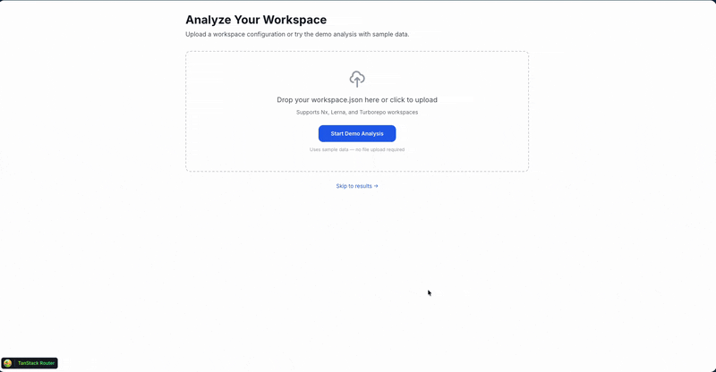

<div align="center">

**[English](README.md)** | [繁體中文](README.zh-TW.md)

# MonoGuard

**Analyze your monorepo health in seconds.**

[](LICENSE)
[](https://www.typescriptlang.org/)
[](https://go.dev/)
[](https://pnpm.io/)

[Demo](https://monoguard-web.onrender.com) · [Documentation](docs/) · [Report Bug](https://github.com/j620656786206/MonoGuard/issues)

</div>

---

## What is MonoGuard?

MonoGuard is an open-source tool that helps you understand and improve your monorepo's dependency health. Upload your workspace configuration and get instant insights into:

- **Circular Dependencies** — Detect dependency cycles that cause build issues and tight coupling
- **Dependency Graph Visualization** — Interactive D3.js graph showing package relationships
- **Health Score** — A single metric (0-100) summarizing your monorepo's overall health
- **Architecture Validation** — Verify layer dependencies follow your rules
- **Bundle Impact Analysis** — Find duplicate dependencies bloating your bundles

<div align="center">



*Interactive dependency graph with circular dependency highlighting*

</div>

## Quick Start

### Try the Demo

Visit [monoguard-web.onrender.com](https://monoguard-web.onrender.com) and click **"Start Demo Analysis"** — no signup required.

### Run Locally

```bash
# Clone the repository
git clone https://github.com/j620656786206/MonoGuard.git
cd monoguard

# Install dependencies
pnpm install

# Start the web app
pnpm dev:web
```

Open [http://localhost:5173](http://localhost:5173) and start analyzing.

## Features

### Circular Dependency Detection

MonoGuard identifies both direct and indirect circular dependencies in your monorepo:

- **Direct cycles**: `A → B → A`
- **Indirect cycles**: `A → B → C → A`

Each cycle includes severity rating, impact assessment, and fix recommendations.

### Interactive Dependency Graph

Visualize your entire package dependency structure with:

- Force-directed graph layout
- Zoom, pan, and minimap navigation
- Node expand/collapse for large graphs
- Highlighted circular dependency paths
- Export to SVG/PNG

### Health Score

Get a single number (0-100) representing your monorepo health, broken down by:

- Dependency health (duplicates, conflicts)
- Architecture compliance
- Maintainability metrics
- Security considerations

### Report Export

Export your analysis results in multiple formats:

- **HTML** — Shareable standalone report
- **JSON** — Machine-readable for CI integration
- **Markdown** — Perfect for PR descriptions

## Tech Stack

| Layer | Technology |
|-------|------------|
| Frontend | React 19, TanStack Router, Tailwind CSS |
| Visualization | D3.js (hybrid SVG/Canvas rendering) |
| Backend | Go 1.21, Gin framework |
| Types | Shared TypeScript types (`@monoguard/types`) |
| Build | pnpm workspaces, Vite |

## Project Structure

```
monoguard/
├── apps/
│   ├── web/          # React web application
│   └── api/          # Go API server
├── packages/
│   └── types/        # Shared TypeScript types
└── docs/             # Documentation
```

## Roadmap

- [x] Circular dependency detection
- [x] D3.js dependency graph visualization
- [x] Health score calculation
- [x] Report export (HTML/JSON/Markdown)
- [ ] WebAssembly analyzer (client-side analysis)
- [ ] GitHub integration (analyze from repo URL)
- [ ] CI/CD integration (GitHub Actions, etc.)
- [ ] VS Code extension

See [ROADMAP.md](ROADMAP.md) for the full roadmap with details.

## Contributing

We welcome contributions! See [CONTRIBUTING.md](CONTRIBUTING.md) for guidelines.

```bash
# Development setup
pnpm install
pnpm dev:web

# Run tests
pnpm test

# Type check
pnpm type-check
```

## License

Apache License 2.0 — see [LICENSE](LICENSE) for details.

---

<div align="center">

**[Try MonoGuard Now →](https://monoguard-web.onrender.com)**

Built with care by the MonoGuard team

</div>
