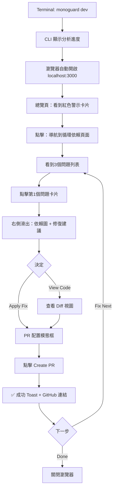
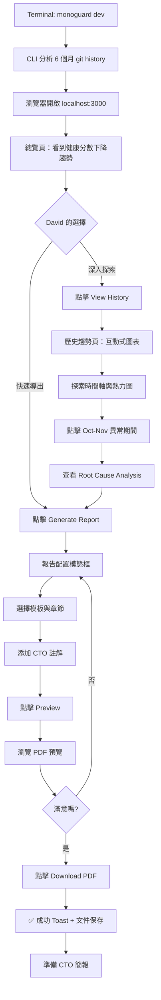

# UX Design Specification mono-guard

**Author:** Alexyu
**Date:** 2026-01-11

---

<!-- UX design content will be appended sequentially through collaborative workflow steps -->

## Executive Summary

### Project Vision

MonoGuard 是新一代的 monorepo 依賴分析與架構健康管理工具，致力於將「被動檢測」轉變為「主動解決」。

**核心定位：**

> "Nx tells you there are circular dependencies. MonoGuard tells you how to fix them."

不同於傳統工具只告訴開發者「哪裡有問題」，MonoGuard 更進一步提供**可執行的修復方案**、**歷史趨勢分析**，以及**自動化修復能力**，從根本改變開發者處理技術債的方式。

**產品哲學：**

- **隱私優先** - 100% 離線運行，零資料外洩風險
- **零成本架構** - TanStack Start + WASM，$0/月運營成本
- **漸進式信任** - 從建議到自動修復的透明化旅程

### Target Users

**主要使用者群體：**

1. **前端開發者（Sarah 代表）**
   - **情境**：定期健康檢查 + 緊急問題修復
   - **頻率**：每週定期使用 + 遇到問題時
   - **痛點**：循環依賴修復耗時 3+ 小時，影響週末計劃
   - **期望**：< 5 分鐘快速修復，清晰的逐步指南

2. **Tech Lead（David 代表）**
   - **情境**：定期架構健康檢查，季度會議數據報告
   - **頻率**：每週定期掃描，季度深度分析
   - **痛點**：缺乏量化數據說服 CTO 投資重構
   - **期望**：視覺化趨勢圖、可匯出的 PDF 報告、歷史對比

3. **DevOps 工程師（Alex 代表）**
   - **情境**：CI/CD 整合，PR 自動檢查
   - **頻率**：每個 PR 自動觸發
   - **痛點**：週五下午總是被 page 處理依賴問題
   - **期望**：自動化守門員，在問題進入 codebase 前攔截

4. **資淺開發者（潛在使用者）**
   - **情境**：學習階段，理解 monorepo 最佳實踐
   - **頻率**：遇到問題或學習時
   - **痛點**：依賴概念抽象難懂，不知道如何下手
   - **期望**：教育性內容、視覺化解釋、簡單的入門體驗

**使用頻率模式：**

- **定期使用**：每週健康檢查（類似健康體檢）
- **事件驅動**：CI 失敗、發現技術債、重構計劃前
- **持續整合**：GitHub PR 自動檢查（DevOps 場景）

### Key Design Challenges

**1. 信任建立 vs. 自動化恐懼**

- **挑戰**：使用者害怕「自動修復破壞程式碼」
- **UX 策略**：
  - 漸進式披露修復邏輯（顯示「為什麼這樣修」）
  - 修復前的影響評估預覽
  - Git diff 視覺化對比
  - 測試覆蓋率指標顯示
  - 「Undo」機制設計

**2. 複雜性 vs. 易用性**

- **挑戰**：依賴圖可能包含 100-1000+ packages，如何不讓使用者overwhelmed？
- **UX 策略**：
  - 智能過濾與聚焦（只顯示問題節點）
  - 漸進式揭露（Summary → Details → Deep Dive）
  - 視覺化層級設計（L1: 健康分數 → L2: 分類問題 → L3: 詳細圖表）
  - 為資淺使用者提供「Guided Mode」

**3. 效能焦慮 vs. 深度分析**

- **挑戰**：使用者害怕「分析太慢」，但深度分析確實需要時間
- **UX 策略**：
  - 即時回饋設計（0.5s 顯示初步結果，3s 完整報告）
  - 進度指示器（顯示「正在分析 52/100 packages」）
  - 背景分析 + 增量更新（先顯示快取結果，背景更新）
  - 設定期望值（「深度分析預計 30 秒」）

**4. 多平台一致性**

- **挑戰**：Web UI、CLI、未來的 VSCode 擴充需要一致體驗
- **UX 策略**：
  - 統一的設計語言（顏色、圖示、術語）
  - 核心互動模式一致（分析 → 檢視 → 修復）
  - 平台特定優化（CLI 重文字輸出，Web 重視覺化）

**5. 從檢測工具到解決方案的心智模型轉變**

- **挑戰**：使用者習慣「工具告訴我問題」，不習慣「工具幫我修」
- **UX 策略**：
  - Onboarding 突出差異化（「不只檢測，還幫你修」）
  - 修復按鈕的視覺層級設計
  - 成功案例與時間節省量化（「為你節省 2.5 小時」）

### Design Opportunities

**1. 時光機的「WOW」因素**

- **機會**：打造 monorepo 工具中獨一無二的歷史視覺化體驗
- **UX 亮點**：
  - Figma 風格的時間軸動畫（拖動滑桿看歷史演變）
  - 「Before/After」對比視圖（季度改善可視化）
  - AI 預測趨勢曲線（「照此趨勢，3 個月後將達到健康狀態」）
  - 社交分享友善（生成精美的進步圖表）

**2. 零學習曲線的極致體驗**

- **機會**：拖放 package.json → 立即看結果，無需註冊、配置
- **UX 亮點**：
  - Landing page 內嵌 Live Demo（真實分析 MonoGuard 自己）
  - 一鍵範例載入（「試試分析 React monorepo」）
  - 無需後端，完全離線 = 絕對隱私（轉換為信任優勢）

**3. 漸進式信任建立旅程**

- **機會**：從「觀察者」→「建議接受者」→「自動化授權者」
- **UX 亮點**：
  - Phase 1：只檢視，建立熟悉感
  - Phase 2：手動執行建議，看到效果
  - Phase 3：一鍵 PR 生成，審查後合併
  - Phase 4：完全自動修復（需手動啟用）
  - 每階段的成功次數可視化（「已成功修復 23 次循環依賴，0 次失敗」）

**4. 遊戲化的健康改善激勵**

- **機會**：將枯燥的技術債管理轉變為有成就感的遊戲
- **UX 亮點**：
  - 架構健康分數（58 → 72，視覺化進步）
  - 成就徽章系統（「連續 4 週無新增循環依賴」）
  - 團隊排行榜（企業版）
  - Spotify Wrapped 風格的年度回顧（病毒式傳播）

**5. 多角色儀表板差異化**

- **機會**：同一數據，不同角色看到不同重點
- **UX 亮點**：
  - **Developer View**：問題列表 + 快速修復
  - **Tech Lead View**：趨勢圖 + ROI 計算 + 匯出報告
  - **DevOps View**：CI 整合狀態 + 自動化配置
  - 一鍵切換視角

## Core User Experience

### Defining Experience

**MonoGuard 的核心體驗是「三位一體」的依賴健康管理循環：**

MonoGuard 不是單一用途工具，而是貫穿整個依賴管理生命週期的完整解決方案，整合了三種互補的使用模式：

**1. 快速修復模式（緊急救火）**

- **情境**：CI 失敗，星期五下午循環依賴阻擋部署
- **核心流程**：分析 → 定位問題 → 一鍵修復 → 生成 PR
- **成功指標**：從 3+ 小時縮短到 30 秒

**2. 健康檢查模式（預防性維護）**

- **情境**：每週定期掃描，季度會議報告
- **核心流程**：儀表板 → 趨勢圖 → 識別劣化 → 預防性優化
- **成功指標**：架構健康分數持續改善（如 58 → 72）

**3. 探索理解模式（複雜性可視化）**

- **情境**：理解 monorepo 架構，重構規劃，新人 onboarding
- **核心流程**：依賴圖 → 互動探索 → 洞察模式 → 決策支援
- **成功指標**：從「困惑」到「理解」的轉變

**整合體驗：**
這三種模式並非孤立存在，而是形成連續的使用旅程：

- **探索理解**（認識問題）→ **健康檢查**（追蹤進步）→ **快速修復**（解決問題）→ 循環往復

**核心互動原則：**

1. **即時回饋** - 0.5 秒顯示初步結果，3 秒完整報告
2. **漸進式揭露** - 從健康分數到詳細圖表的三層資訊架構
3. **行動導向** - 每個問題都附帶可執行的修復方案
4. **透明化信任** - 顯示「為什麼」和「如何」，而非黑箱魔法

### Platform Strategy

**主要平台：Web UI（80%+ 使用場景）**

MonoGuard 採用「CLI + 本地 Web Server」的創新架構，結合離線優先與視覺化優勢：

**核心工作流程：**

```bash
# 1. CLI 分析（離線執行）
$ monoguard analyze

# 2. 啟動本地 dev server
$ monoguard serve
✓ Analysis complete
✓ Local server running at http://localhost:3000

# 3. 瀏覽器自動打開，查看視覺化結果
```

**平台特性：**

1. **Web UI（主力平台）**
   - **優勢**：豐富的視覺化、互動式依賴圖、拖放上傳
   - **技術**：TanStack Start + WASM（零後端依賴）
   - **模式**：
     - **在線模式**：訪問 monoguard.dev，拖放 package.json 即時分析
     - **離線模式**：CLI 分析 → 本地 server → localhost 查看
   - **響應式設計**：桌面優先，平板友善（不優化手機）

2. **CLI（開發者 + CI/CD）**
   - **優勢**：CI/CD 整合、腳本化、批次處理
   - **輸出格式**：JSON（機器可讀）+ 精簡文字（人類可讀）
   - **核心指令**：
     - `monoguard analyze` - 分析並生成報告
     - `monoguard serve` - 啟動本地視覺化 server
     - `monoguard fix` - 執行自動修復

3. **未來擴展（Phase 1+）**
   - **VSCode 擴充**：即時依賴健康提示（類似 ESLint）
   - **GitHub App**：PR 自動檢查與留言

**離線優先哲學：**

- **100% 隱私保證** - 所有分析在本地執行，零資料上傳
- **WASM 驅動** - Go 分析引擎編譯成 WASM，瀏覽器直接執行
- **零基礎設施成本** - Cloudflare Pages 靜態託管 = $0/月

**平台一致性原則：**

- **統一術語**：所有平台使用相同的錯誤代碼、嚴重性分級
- **核心流程一致**：分析 → 檢視 → 修復（無論 CLI 或 Web）
- **平台特定優化**：CLI 重效率文字輸出，Web 重視覺化互動

### Effortless Interactions

**MonoGuard 將複雜的依賴分析轉變為零學習曲線的直覺體驗：**

**1. 零配置啟動（Web UI）**

- **動作**：拖放 `package.json` 或 `pnpm-workspace.yaml` 到瀏覽器
- **結果**：0.5 秒顯示健康分數，3 秒完整分析
- **無需**：註冊、登入、配置檔、環境設定
- **設計**：Landing page 內嵌 Live Demo，拖放區域視覺突出

**2. 一鍵範例載入**

- **動作**：點擊「試試分析 React monorepo」
- **結果**：立即載入真實範例，體驗完整功能
- **目的**：降低首次使用門檻，建立信心

**3. 智能問題定位**

- **動作**：點擊依賴圖中的紅色節點
- **結果**：自動聚焦問題區域，淡化無關節點，右側顯示修復建議
- **無需**：手動篩選、搜尋、配置過濾器

**4. 漸進式視覺揭露**

- **L1（首屏）**：單一數字健康分數（如 68/100）+ 紅/黃/綠問題計數
- **L2（點擊）**：分類問題列表（循環依賴、版本衝突、重複套件）
- **L3（深入）**：詳細依賴圖、歷史趨勢、修復建議
- **設計**：每層都是完整資訊，不是「loading...」的佔位符

**5. 修復前預覽**

- **動作**：點擊「Apply Fix」前，查看影響評估
- **結果**：顯示將修改的檔案、Git diff 預覽、潛在風險警告
- **設計**：透明化建立信任，消除「破壞程式碼」恐懼

**6. CLI 到 Web 無縫銜接**

- **動作**：`monoguard serve` 執行後
- **結果**：瀏覽器自動打開 localhost:3000，分析結果已載入
- **無需**：手動複製 URL、重新上傳檔案、重新分析

**7. 即時搜尋與過濾**

- **動作**：輸入 `react` 在搜尋框
- **結果**：即時高亮相關 packages，依賴圖聚焦匹配節點
- **性能**：1000+ packages 依然流暢（虛擬化渲染）

### Critical Success Moments

**使用者體驗的「決定性時刻」- 成功或放棄的分水嶺：**

**1. 首次分析的「WOW」時刻（< 5 秒）**

- **時機**：拖放 package.json 後的前 5 秒
- **目標**：立即顯示有價值的洞察
- **設計**：
  - 0.5s：健康分數動畫（58 → 顯示）
  - 1.5s：問題分類卡片浮現
  - 3s：依賴圖開始渲染
- **失敗風險**：超過 5 秒無反饋 = 使用者流失

**2. 修復建議的「可信度」時刻**

- **時機**：使用者第一次看到自動修復建議
- **目標**：建立「這個工具懂我的專案」的信任
- **設計**：
  - 顯示修復策略的「為什麼」（WHY this fix）
  - 影響範圍評估（Will affect 3 files in packages/core）
  - 成功率指標（Similar fixes: 94% success rate）
  - Git diff 預覽
- **失敗風險**：建議不合理或缺乏解釋 = 信任崩潰

**3. 30 秒 PR 生成的「魔法」時刻 ⭐**

- **時機**：點擊「Generate Fix PR」按鈕後
- **目標**：從 3+ 小時手動修復縮短到 30 秒
- **設計**：
  - 進度指示（Analyzing dependencies → Generating fixes → Creating PR）
  - 實時日誌（Modified packages/auth/package.json）
  - PR 連結立即可點擊
  - 顯示節省時間（⏱️ Saved ~3.2 hours）
- **這是 MonoGuard 的核心差異化時刻**

**4. 歷史趨勢的「成就感」時刻**

- **時機**：第 2-3 次使用，查看 Time Machine
- **目標**：視覺化進步，強化持續使用動機
- **設計**：
  - 健康分數曲線圖（58 → 65 → 72）
  - 「Before/After」對比視圖
  - 成就徽章（🏆 3 weeks without new circular dependencies）
- **失敗風險**：無法呈現進步 = 失去持續使用動力

**5. 首次成功修復的「信任轉折」時刻**

- **時機**：使用者第一次應用自動修復並測試成功
- **目標**：從「觀察者」轉變為「信任自動化者」
- **設計**：
  - 修復後的驗證提示（✓ Tests passed, build succeeded）
  - 邀請分享成功（Share your success on Twitter）
  - 解鎖進階功能（Enable auto-fix for future PRs?）
- **關鍵轉折**：從此開始信任自動化能力

**6. 資淺開發者的「理解」時刻**

- **時機**：第一次看到循環依賴視覺化
- **目標**：從「不懂什麼是循環依賴」到「啊！原來是這樣」
- **設計**：
  - 動畫演示循環路徑（A → B → C → A，箭頭循環高亮）
  - 淺顯易懂的說明（"這些 packages 互相依賴，形成無限循環"）
  - 教育性內容連結（📖 Learn: Why circular dependencies are bad）
- **失敗風險**：過於技術化 = 新手放棄

### Experience Principles

**MonoGuard UX 設計的核心指導原則：**

**1. 透明化建立信任（Trust Through Transparency）**

- **原則**：永遠顯示「為什麼」和「如何」，而非黑箱魔法
- **實踐**：
  - 每個修復建議都解釋邏輯
  - 影響範圍預覽（修改哪些檔案）
  - 成功率與風險指標
  - Undo 機制永遠可用
- **目標**：消除「自動修復破壞程式碼」的恐懼

**2. 漸進式揭露，不是資訊轟炸（Progressive Disclosure）**

- **原則**：從簡單到複雜的三層資訊架構
- **實踐**：
  - L1：一個數字（健康分數）+ 三個顏色（紅/黃/綠）
  - L2：分類問題列表（可點擊展開）
  - L3：詳細圖表、歷史資料、深度分析
- **目標**：新手不被嚇跑，專家能深入挖掘

**3. 即時回饋，零等待焦慮（Instant Feedback）**

- **原則**：0.5 秒必須有視覺反饋
- **實踐**：
  - 拖放後立即顯示上傳動畫
  - 0.5s 顯示健康分數（快取或快速計算）
  - 長操作顯示實時進度（正在分析 52/100 packages）
  - 背景分析 + 增量更新
- **目標**：消除「分析太慢」的焦慮

**4. 行動導向，不只是報告（Action-Oriented）**

- **原則**：每個問題都附帶可執行的解決方案
- **實踐**：
  - 問題卡片包含「Fix」按鈕
  - 修復建議有明確的 CTA（Call-to-Action）
  - 一鍵 PR 生成
  - 引導式修復流程（Step 1 → Step 2 → Done）
- **目標**：從「告訴問題」到「解決問題」的範式轉變

**5. 隱私優先，零妥協（Privacy-First）**

- **原則**：100% 本地分析，零資料上傳
- **實踐**：
  - WASM 瀏覽器執行
  - CLI 離線模式
  - 明確的隱私標示（🔒 All analysis runs locally）
  - 無需註冊或登入
- **目標**：建立「絕對安全」的信任基礎

**6. 平台一致，體驗無縫（Platform Consistency）**

- **原則**：CLI、Web、未來 VSCode 擴充使用統一語言
- **實踐**：
  - 相同的錯誤代碼（E001: Circular Dependency）
  - 一致的嚴重性分級（Critical/High/Medium/Low）
  - 統一的術語（不是 Web 說「循環依賴」，CLI 說「circular deps」）
- **目標**：跨平台學習曲線為零

**7. 成就可視化，持續激勵（Visible Progress）**

- **原則**：讓進步看得見、摸得著、分享得出去
- **實踐**：
  - 健康分數趨勢圖
  - 成就徽章系統
  - 時間節省統計（Total time saved: 47.3 hours）
  - Spotify Wrapped 風格年度回顧
- **目標**：將技術債管理從「苦差事」變成「有成就感的遊戲」

## Desired Emotional Response

### Primary Emotional Goals

**MonoGuard 的雙核心情感策略：驚喜 + 信任**

**1. 驚喜與興奮（Delighted & Amazed）**

- **核心時刻**：「哇！30 秒就修好了？我原本以為要花 3 小時！」
- **設計目標**：創造超越預期的「魔法時刻」
- **實現方式**：
  - 極速反饋（0.5s 健康分數，3s 完整報告）
  - 30 秒 PR 生成（核心差異化）
  - 視覺化的「wow」因素（Time Machine 動畫）
  - 量化時間節省（「⏱️ Saved ~3.2 hours」）
- **為什麼重要**：驚喜是口碑傳播的催化劑，是使用者分享給同事的動力

**2. 信任與安心（Trust & Relief）**

- **核心時刻**：「這個工具真的懂我的專案，修復邏輯很合理」
- **設計目標**：消除「自動修復破壞程式碼」的恐懼
- **實現方式**：
  - 透明化修復邏輯（顯示「WHY」和「HOW」）
  - 影響範圍預覽（Git diff、檔案列表）
  - 成功率指標（「Similar fixes: 94% success rate」）
  - Undo 機制永遠可用
  - 漸進式信任建立旅程（觀察→建議→自動化）
- **為什麼重要**：信任是長期使用的基礎，沒有信任就沒有採用

**情感組合策略：**
MonoGuard 不選擇單一情感，而是設計「驚喜→信任」的進程：

1. **首次使用**：驚喜主導（速度、視覺化、即時結果）
2. **深度使用**：信任建立（透明邏輯、成功追蹤、可預測性）
3. **持續使用**：信任為基礎，驚喜為調味（新功能、進步視覺化）

### Emotional Journey Mapping

**完整的情感曲線：從焦慮到興奮的轉變**

**階段 1：發現與初次接觸（Discovery）**

- **情境**：CI 失敗，循環依賴錯誤，星期五下午
- **情感狀態**：😰 焦慮、壓力、挫敗感
- **設計回應**：
  - Landing page 強調「快速修復」而非「分析工具」
  - 零配置拖放（降低進入門檻）
  - 立即視覺反饋（0.5s 必須有回應）

**階段 2：首次分析（First Analysis）**

- **情感狀態**：🤔 好奇 + 半信半疑
- **關鍵轉折**：**焦慮 → 好奇**
- **設計回應**：
  - 拖放檔案後的即時動畫回饋
  - 「分析中」進度指示（避免焦慮）
  - 3 秒內顯示有價值的洞察

**階段 3：查看結果（Viewing Results）**

- **情感狀態**：😲 驚訝 + 😨 焦慮（如果分數低）或 😊 驕傲（如果分數高）
- **設計回應**：
  - 健康分數視覺化（58/100 紅色 vs. 87/100 綠色）
  - 分數低時的鼓勵語言（「有改善空間，讓我們一起修復！」）
  - 分數高時的肯定（「🎉 架構健康狀態良好！」）
  - 漸進式揭露避免 overwhelmed

**階段 4：探索修復建議（Exploring Fixes）**

- **情感狀態**：🤨 懷疑 →謹慎評估
- **關鍵轉折**：**懷疑 → 信任**（最重要轉折點）
- **設計回應**：
  - 修復邏輯的清晰解釋（「WHY this fix works」）
  - 影響範圍評估（「Will affect 3 files in packages/core」）
  - Git diff 預覽（視覺化修改內容）
  - 成功率與風險指標（建立證據基礎的信任）

**階段 5：執行修復（Applying Fix）**

- **情感狀態**：😬 緊張 + 期待
- **設計回應**：
  - 實時進度日誌（「Modified packages/auth/package.json」）
  - 可視化的修復流程（Step 1 → Step 2 → Done）
  - 「安全網」提示（「You can undo this anytime」）

**階段 6：成功時刻（Success Moment）**

- **情感狀態**：😮‍💨 如釋重負 → 😃 興奮
- **關鍵轉折**：**壓力 → 解脫**（第二重要轉折點）
- **設計回應**：
  - PR 連結立即可點擊
  - 節省時間量化（「⏱️ Saved ~3.2 hours」）
  - 成功慶祝動畫（✓ 綠色勾選）
  - 邀請分享（「Share your success」）

**階段 7：驗證與建立信心（Validation）**

- **情感狀態**：😌 滿足 + 💪 掌控感
- **設計回應**：
  - 測試通過提示（「✓ Tests passed, build succeeded」）
  - 解鎖進階功能（「Enable auto-fix for future PRs?」）
  - 成功案例追蹤（「Successfully fixed 1 circular dependency」）

**階段 8：回訪與持續使用（Return Visits）**

- **情感狀態**：🏆 成就感 + 😊 習慣與信任
- **設計回應**：
  - Time Machine 顯示進步（58 → 65 → 72）
  - 成就徽章（「🏆 3 weeks without new circular dependencies」）
  - 預防性提醒（避免技術債累積的焦慮）

### Micro-Emotions

**關鍵互動時刻的微妙情感設計：**

**1. 拖放檔案瞬間**

- **目標情感**：🤔 **好奇**
- **設計策略**：
  - 拖放區域的 hover 效果（視覺吸引）
  - 「或點擊選擇檔案」的友善提示
  - 上傳動畫立即開始（滿足好奇心）
- **避免**：緊張、猶豫（透過零風險提示：「100% 本地分析」）

**2. 查看健康分數時**

- **目標情感（雙軌）**：
  - **高分（≥75）**：😊 **驕傲** + 滿足
  - **低分（<60）**：😨 **焦慮** → 😤 **決心修復**
- **設計策略**：
  - 高分：綠色 + 肯定語言（「Excellent architecture health!」）
  - 低分：紅色但非懲罰性語言（「Opportunities for improvement」而非「Poor health」）
  - 立即提供行動方案（將焦慮轉化為行動）
  - 顯示改善潛力（「+14 points possible with recommended fixes」）
- **避免**：挫敗感、overwhelmed

**3. 修復前預覽時**

- **目標情感**：🧐 **謹慎** + 掌控感
- **設計策略**：
  - Git diff 逐行對比（細節透明化）
  - 檔案變更清單（可預期的範圍）
  - 「Apply」按鈕不過度激進（中性顏色，非綠色）
  - 「Preview」標籤清晰（知道這只是預覽）
- **避免**：恐懼、衝動行動

**4. PR 生成成功時**

- **目標情感**：😮‍💨 **如釋重負** → 🎉 **成就感**
- **設計策略**：
  - 成功動畫（綠色勾選 + 微妙的慶祝效果）
  - PR 連結明顯可點擊（立即行動）
  - 時間節省量化（具體化成就）
  - 分享按鈕（延伸成就感到社交層面）
- **避免**：平淡無奇（這是關鍵時刻，需要慶祝）

**5. 首次成功修復後**

- **目標情感**：🤝 **信任建立** + 😌 **安心**
- **設計策略**：
  - 驗證結果顯示（「Tests passed」建立證據）
  - 成功追蹤開始（「1/1 fixes successful」）
  - 邀請更深入使用（「Ready to enable auto-fix?」）
- **避免**：過度推銷（尊重漸進式信任建立）

**6. 查看 Time Machine 歷史時**

- **目標情感**：📈 **成就感** + 💪 **動力**
- **設計策略**：
  - 上升曲線視覺化（進步可見）
  - Before/After 對比（量化改善）
  - 成就徽章解鎖（遊戲化激勵）
  - 預測未來趨勢（「照此趨勢，3 個月後達到 85 分」）
- **避免**：無感、枯燥（進步必須令人興奮）

### Design Implications

**情感目標如何轉化為具體 UX 設計決策：**

**1. 驚喜與興奮 → 速度與視覺魔法**

- **UX 決策**：
  - 0.5 秒必須有視覺反饋（即時性）
  - Time Machine 使用 Figma 風格時間軸動畫
  - 30 秒 PR 生成的實時進度日誌
  - 節省時間的量化顯示（具體化驚喜）
- **避免**：Loading spinners、無意義的等待畫面

**2. 信任與安心 → 透明化與可預測性**

- **UX 決策**：
  - 每個修復建議都附帶「WHY」說明
  - Git diff 預覽（讓使用者看到具體改動）
  - 成功率指標（證據基礎的信任）
  - Undo 機制永遠可見
- **避免**：黑箱操作、「相信我」式的設計

**3. 好奇心 → 探索友善的介面**

- **UX 決策**：
  - 拖放區域視覺突出（邀請互動）
  - 一鍵範例載入（降低嘗試門檻）
  - 互動式依賴圖（點擊探索）
  - 教育性 tooltips（滿足學習慾望）
- **避免**：複雜的表單、冗長的 onboarding

**4. 避免 Overwhelmed → 漸進式揭露**

- **UX 決策**：
  - 三層資訊架構（L1: 分數 → L2: 問題列表 → L3: 詳細圖表）
  - 智能過濾（只顯示問題節點）
  - 「Show more」而非一次性展開
  - 虛擬化渲染（1000+ packages 依然流暢）
- **避免**：首屏顯示所有資訊、複雜的儀表板

**5. 避免 Confused → 清晰的引導**

- **UX 決策**：
  - 統一的錯誤代碼與術語
  - 淺顯易懂的說明（「這些 packages 互相依賴，形成無限循環」）
  - 視覺化循環路徑動畫（教育性）
  - 「Guided Mode」給資淺開發者
- **避免**：技術黑話、假設使用者已知概念

**6. 謹慎評估 → 充分資訊提供**

- **UX 決策**：
  - 修復前的影響評估（修改哪些檔案）
  - 風險指標（Critical/High/Medium/Low）
  - 測試覆蓋率顯示（建立信心）
  - 「Preview」模式清晰標示
- **避免**：隱藏細節、過度簡化

**7. 成就感 → 進步可視化**

- **UX 決策**：
  - 健康分數趨勢圖（58 → 72 的曲線）
  - 成就徽章系統
  - 時間節省總計（「Total time saved: 47.3 hours」）
  - Spotify Wrapped 風格年度回顧
- **避免**：靜態數字、無對比的單點資料

### Emotional Design Principles

**MonoGuard 情感設計的指導原則：**

**1. 速度創造驚喜（Speed Creates Delight）**

- **原則**：每個操作都要比使用者預期的快
- **實踐**：
  - 0.5s 視覺反饋（即時性）
  - 3s 完整分析（超越預期）
  - 30s PR 生成（核心魔法時刻）
- **測試**：內部目標比對外承諾快 2 倍（over-deliver）

**2. 透明化建立信任（Transparency Builds Trust）**

- **原則**：永遠顯示「為什麼」，而非要求盲目相信
- **實踐**：
  - 修復邏輯解釋（WHY this fix）
  - 影響範圍預覽（WHAT will change）
  - 成功率指標（HOW reliable）
- **測試**：每個自動化操作都有「查看細節」選項

**3. 漸進式揭露避免壓垮（Progressive Disclosure Prevents Overwhelm）**

- **原則**：從簡單到複雜的資訊階梯
- **實踐**：
  - L1：一個數字 + 三個顏色
  - L2：問題分類列表
  - L3：詳細圖表與歷史
- **測試**：新手在 L1 就能採取行動，專家能深入到 L3

**4. 謹慎轉化為掌控（Caution Becomes Control）**

- **原則**：尊重使用者的謹慎，提供充分資訊支持決策
- **實踐**：
  - 預覽而非直接執行
  - Undo 機制永遠可用
  - 影響評估詳細呈現
- **測試**：使用者應該感到「我在掌控」而非「工具在控制我」

**5. 小勝利累積大成就（Small Wins Build Momentum）**

- **原則**：每個互動都創造微小的成就感
- **實踐**：
  - 修復一個問題 → 立即慶祝
  - 分數提升 1 分 → 視覺化進度
  - 連續 X 天無新問題 → 徽章解鎖
- **測試**：使用者應該頻繁感到「我在進步」

**6. 恐懼轉化為行動（Fear Transforms to Action）**

- **原則**：將負面情緒（焦慮、恐懼）轉化為可執行的行動
- **實踐**：
  - 低健康分數 → 立即顯示「Top 3 Quick Wins」
  - 技術債警告 → 提供修復路徑圖
  - 問題通知 → 附帶解決方案
- **測試**：每個負面反饋都有明確的 CTA（Call-to-Action）

**7. 習慣源於可靠（Habit Comes from Reliability）**

- **原則**：一致的體驗建立習慣與信任
- **實踐**：
  - 平台間統一術語
  - 可預測的結果（相同輸入 → 相同輸出）
  - 穩定的性能（不會今天快明天慢）
- **測試**：使用者應該能預測工具的行為

## UX Pattern Analysis & Inspiration

### Inspiring Products Analysis

基於 MonoGuard 的核心定位（開發者分析工具 + 自動修復）與情感目標（驚喜 + 信任），我分析了三個關鍵靈感來源：

#### 1. **Vercel Dashboard** - 速度創造驚喜的典範

**為什麼選擇這個產品：**

- 同樣面向開發者，需要在複雜資訊中提供快速洞察
- 以「速度」作為核心體驗差異化
- 成功將技術工具打造成令人愉悅的產品

**UX 成功要素：**

- **即時反饋系統** - 部署狀態的實時更新（0.5s 內響應）
- **漸進式資訊披露** - 首屏顯示關鍵狀態，細節可深入展開
- **視覺化成就感** - 成功部署的動畫反饋讓人感到滿足
- **預測性 UI** - 在使用者操作前就預載可能需要的資訊
- **清晰的錯誤處理** - 錯誤訊息不只說「什麼錯了」，更提供「如何修復」

**對 MonoGuard 的啟發：**

- 0.5s 即時反饋 → 拖放檔案後立即顯示分析進度
- 漸進式披露 → L1/L2/L3 資訊架構（概覽→詳情→深度分析）
- 成就感視覺化 → 健康分數提升的動畫慶祝

#### 2. **GitHub Pull Request Interface** - 信任感的建立典範

**為什麼選擇這個產品：**

- 處理「程式碼變更」這個高風險操作
- 使用者需要 100% 確信變更的安全性
- 透明度是核心 UX 策略

**UX 成功要素：**

- **完整的變更預覽** - Diff View 讓使用者看到每一行變更
- **多層次的審核機制** - 從 CI 檢查到人工審核的清晰流程
- **可逆性設計** - 明確的 Revert 選項降低焦慮
- **狀態追蹤** - 清楚的時間軸顯示 PR 歷程
- **協作透明化** - 評論、建議、批准的完整記錄

**對 MonoGuard 的啟發：**

- 完整預覽 → 修復前後的完整 Diff View
- 可逆性 → 明確的「Preview → Apply → Undo」流程
- 透明化 → 顯示修復邏輯的完整推理過程

#### 3. **Linear (Issue Tracking)** - 效率與美感的完美結合

**為什麼選擇這個產品：**

- 重新定義「專案管理工具」的 UX 標準
- 證明開發者工具也可以「令人愉悅」
- 鍵盤優先的高效操作

**UX 成功要素：**

- **鍵盤為中心的操作** - Cmd+K 萬能指令面板
- **即時搜尋** - 輸入即搜尋，無需按下 Enter
- **優雅的動畫** - 流暢的過渡動畫提升專業感
- **智慧預測** - 根據歷史行為預填資訊
- **極簡的視覺設計** - 專注於內容，而非裝飾

**對 MonoGuard 的啟發：**

- 鍵盤快捷鍵 → 高級使用者的快速操作路徑
- 即時搜尋 → 依賴關係圖的即時過濾
- 優雅動畫 → 健康分數變化的流暢過渡

### Transferable UX Patterns

從這些產品中提取可直接應用於 MonoGuard 的模式：

#### Navigation Patterns

**1. Command Palette（Cmd+K）模式**

- **來源：** Linear
- **應用場景：** MonoGuard 的快速操作入口
- **具體實現：**
  - `Cmd+K` → 快速搜尋依賴、跳轉模組、執行操作
  - 支援模糊搜尋與鍵盤導航
  - 顯示最近操作與常用指令
- **情感目標：** 讓高級使用者感到「效率」與「掌控感」

**2. 漸進式資訊披露（L1/L2/L3）**

- **來源：** Vercel Dashboard
- **應用場景：** 複雜分析結果的呈現
- **具體實現：**
  - **L1 (概覽)** - 健康分數 + 關鍵問題數量
  - **L2 (詳情)** - 循環依賴列表 + 影響範圍
  - **L3 (深度)** - 依賴時光機 + 完整 Diff
- **情感目標：** 避免「overwhelmed」，支援不同使用深度

**3. 側邊欄 + 主視窗雙欄布局**

- **來源：** GitHub PR Interface
- **應用場景：** MonoGuard 的瀏覽與操作分離
- **具體實現：**
  - 左側：專案樹 + 健康概覽
  - 右側：詳細分析 + 操作面板
  - 可調整寬度，記憶使用者偏好
- **情感目標：** 熟悉感（開發者習慣的布局）

#### Interaction Patterns

**1. 拖放 + 即時分析**

- **來源：** Vercel 的一鍵部署體驗
- **應用場景：** MonoGuard 的專案導入
- **具體實現：**
  - 拖放資料夾 → 立即顯示進度指示器
  - 0.5s 內開始顯示初步結果
  - 3s 內完成完整分析
- **情感目標：** 「好奇」→「驚喜」的快速轉換

**2. Diff View + Apply 流程**

- **來源：** GitHub PR 的變更預覽
- **應用場景：** 修復建議的應用流程
- **具體實現：**
  - **Step 1：Preview** - 顯示完整 Diff（綠色新增/紅色刪除）
  - **Step 2：Review** - 解釋「為什麼這樣修復」
  - **Step 3：Apply** - 明確的「Apply Changes」按鈕
  - **Step 4：Undo Available** - 保留復原選項
- **情感目標：** 從「謹慎」到「信任」的轉變

**3. 智慧通知與狀態更新**

- **來源：** Linear 的即時同步
- **應用場景：** 長時間分析的進度通知
- **具體實現：**
  - 非阻塞式通知（右下角 Toast）
  - 顯示進度百分比 + 預估剩餘時間
  - 完成時的成功動畫反饋
- **情感目標：** 消除「焦慮」，提供「掌控感」

#### Visual Patterns

**1. 健康分數的視覺化**

- **來源：** Vercel 的部署狀態指示器
- **應用場景：** MonoGuard 的架構健康度
- **具體實現：**
  - 大型數字 + 顏色編碼（綠/黃/紅）
  - 趨勢箭頭（↑ 改善 / ↓ 惡化）
  - 進度環顯示目標達成率
- **情感目標：** 視覺化「成就感」與「焦慮」

**2. 依賴關係圖的互動式視覺化**

- **來源：** GitHub Network Graph
- **應用場景：** 循環依賴的視覺化呈現
- **具體實現：**
  - 可縮放的關係圖（Zoom In/Out）
  - Hover 顯示詳細資訊
  - 點擊節點高亮相關路徑
  - 顏色編碼問題嚴重度
- **情感目標：** 將「confused」轉為「理解」

**3. 動畫反饋系統**

- **來源：** Linear 的流暢過渡
- **應用場景：** 所有狀態變化時刻
- **具體實現：**
  - 健康分數變化的數字滾動動畫
  - PR 生成成功的 ✓ 動畫
  - 載入狀態的骨架屏（Skeleton）
- **情感目標：** 提升「專業感」與「愉悅感」

### Anti-Patterns to Avoid

從開發者工具領域的失敗案例中學習：

**1. ❌ 過度的模態視窗（Modal Overload）**

- **問題：** 打斷使用者流程，強制等待
- **常見於：** 傳統企業軟體（JIRA 早期版本）
- **為什麼要避免：**
  - 違反「Effortless」原則
  - 造成使用者「frustrated」情緒
- **MonoGuard 策略：**
  - 優先使用側邊抽屜（Drawer）
  - 保留上下文，允許多任務操作

**2. ❌ 隱藏的複雜度（Hidden Complexity）**

- **問題：** 看似簡單，實際操作時才發現複雜
- **常見於：** 某些「低代碼」平台
- **為什麼要避免：**
  - 違反「透明度建立信任」原則
  - 造成「confused」→「frustrated」
- **MonoGuard 策略：**
  - 漸進式披露，而非隱藏
  - 總是提供「Why」的解釋

**3. ❌ 過長的等待時間無反饋**

- **問題：** 分析進行中沒有任何進度指示
- **常見於：** 傳統靜態分析工具
- **為什麼要避免：**
  - 造成「anxious」情緒
  - 使用者不知道是否卡住
- **MonoGuard 策略：**
  - 0.5s 規則：立即顯示「正在分析」
  - 3s 規則：顯示初步結果
  - 長時間操作：顯示進度條 + 預估時間

**4. ❌ 技術術語轟炸（Jargon Overload）**

- **問題：** 假設所有使用者都是專家
- **常見於：** 某些 CLI 工具的錯誤訊息
- **為什麼要避免：**
  - 新手使用者感到「overwhelmed」
  - 違反「漸進式專業度」原則
- **MonoGuard 策略：**
  - 預設顯示人類可讀的訊息
  - 「Show Technical Details」選項給專家

**5. ❌ 不可逆的破壞性操作**

- **問題：** 沒有 Preview 或 Undo 選項
- **常見於：** 某些自動化修復工具
- **為什麼要避免：**
  - 造成極高的「fear」與「distrust」
  - 違反「信任」的核心情感目標
- **MonoGuard 策略：**
  - 所有修復都經過 Preview → Approve 流程
  - 明確的 Undo 選項

### Design Inspiration Strategy

基於以上分析，MonoGuard 的設計靈感應用策略：

#### What to Adopt (直接採用)

**1. Vercel 的速度哲學**

- **模式：** 0.5s 即時反饋 + 3s 完整結果
- **原因：** 直接支援「驚喜」的情感目標
- **應用：** 所有使用者操作都遵循這個時間標準

**2. GitHub PR 的透明度設計**

- **模式：** 完整 Diff View + 可逆操作
- **原因：** 直接支援「信任」的情感目標
- **應用：** 修復流程的核心設計原則

**3. Linear 的鍵盤優先**

- **模式：** Cmd+K 指令面板 + 快捷鍵系統
- **原因：** 滿足高級使用者的效率需求
- **應用：** 作為滑鼠操作的補充路徑

#### What to Adapt (調整後採用)

**1. 依賴關係圖的視覺化**

- **原始模式：** GitHub Network Graph
- **調整方向：** 簡化複雜度，專注於問題節點
- **原因：** GitHub 的圖適合完整歷史，MonoGuard 需專注於問題診斷
- **應用：** 只高亮循環依賴路徑，淡化正常依賴

**2. 健康分數儀表板**

- **原始模式：** Vercel 的部署狀態
- **調整方向：** 加入歷史趨勢與目標設定
- **原因：** MonoGuard 更強調「持續改善」而非「單次狀態」
- **應用：** 分數 + 趨勢圖 + 目標設定

**3. 通知系統**

- **原始模式：** Linear 的即時通知
- **調整方向：** 減少通知頻率，只通知關鍵事件
- **原因：** 離線工具不需要像協作工具那樣頻繁通知
- **應用：** 只通知：分析完成、PR 生成成功、發現嚴重問題

#### What to Avoid (明確避免)

**1. JIRA 的模態視窗模式**

- **原因：** 打斷流程，造成 frustrated
- **替代方案：** 側邊抽屜 + 內聯展開

**2. 傳統 CLI 的純文字輸出**

- **原因：** 違反「視覺化」與「易懂」原則
- **替代方案：** 本地 Web UI + 豐富的視覺化

**3. 隱藏複雜度的「魔法黑盒」**

- **原因：** 違反「透明度建立信任」
- **替代方案：** 漸進式披露 + 「Show Details」選項

#### Unique Differentiation Points (MonoGuard 的獨特性)

雖然從這些產品學習，MonoGuard 仍需保持獨特性：

**1. 離線優先的架構**

- 與 Vercel 的雲端模式不同，MonoGuard 100% 本地運行
- 設計含義：不依賴網路的即時反饋更重要

**2. 修復導向，而非僅診斷**

- 與 Nx 的「告訴你有問題」不同，MonoGuard「告訴你怎麼修」
- 設計含義：修復流程是核心 UX，而非附加功能

**3. 時光機視角**

- 獨特的 6 個月歷史追蹤
- 設計含義：時間軸視覺化是差異化特色

**4. 漸進式自動化**

- 從手動修復 → AI 輔助 → 自動修復的學習曲線
- 設計含義：信任度是隨時間建立的，UI 需反映這個過程

## Design System Foundation

### Design System Choice

**選擇：Tailwind CSS + Headless UI + Custom Components**

MonoGuard 採用「Utility-First + 無頭元件」的混合策略，而非完整的設計系統框架。

**核心技術組合：**

- **Tailwind CSS** - Utility-first CSS 框架作為基礎層
- **Headless UI** - 無樣式但完全可訪問的交互組件（由 Tailwind 團隊維護）
- **Custom Components** - 針對 MonoGuard 獨特需求的客製化元件（依賴圖、健康分數等）
- **Radix UI Primitives**（輔助） - 複雜互動元件的無頭基礎（如 Dropdown、Dialog）

**為什麼不選擇完整設計系統：**

- ❌ **Material Design / Ant Design** - 過於企業化，與開發者工具美學不符
- ❌ **Chakra UI** - 雖然好用，但預設樣式過於圓潤，與工具類產品氣質不符
- ❌ **MUI** - 過重，與 TanStack Start 的輕量哲學衝突
- ❌ **完全自訂系統** - 對單人開發者時間成本過高

### Rationale for Selection

**1. 與技術棧完美對齊**

- **TanStack Start 生態** - Tailwind 是 React 生態最主流的 CSS 解決方案
- **WASM 友善** - Utility-first 不需要複雜的 runtime，bundle size 可控
- **零後端架構** - 靜態 CSS，完美契合 Cloudflare Pages 部署

**2. 速度與靈活性平衡**

- **快速開發** - Tailwind 的 utility classes 大幅加速 UI 開發
- **完全客製化** - 不受限於預設元件庫的視覺風格
- **無學習曲線** - Alexyu 可能已熟悉 Tailwind（業界標準）
- **Headless UI 保證可訪問性** - 無需從零實現鍵盤導航、ARIA 屬性

**3. 符合開發者工具美學**

- **清爽現代** - Tailwind 的預設設計語言乾淨、專業
- **工具感** - Vercel、Linear、GitHub 等靈感來源都使用類似設計語言
- **數據密集友善** - 易於構建表格、圖表、數據視覺化

**4. 長期維護優勢**

- **活躍社群** - Tailwind 生態極度活躍，資源豐富
- **未來擴展** - Tailwind UI（付費元件庫）可作為後續加速選項
- **版本穩定** - Tailwind v3+ 已成熟，升級風險低

**5. 性能考量**

- **PurgeCSS 內建** - 生產環境只包含使用的 CSS，極小 bundle
- **JIT 模式** - Just-In-Time 編譯，開發體驗流暢
- **No JavaScript** - 純 CSS 解決方案，不影響 WASM bundle

### Implementation Approach

**Phase 1：設計 Tokens 定義（Week 1）**

```javascript
// tailwind.config.js - MonoGuard Design Tokens
module.exports = {
  theme: {
    extend: {
      colors: {
        // Health Score Colors
        health: {
          excellent: '#10b981', // Green 500 (85-100)
          good: '#22c55e', // Green 400 (70-84)
          fair: '#eab308', // Yellow 500 (50-69)
          poor: '#f97316', // Orange 500 (30-49)
          critical: '#ef4444', // Red 500 (0-29)
        },
        // Dependency Graph Colors
        graph: {
          node: '#3b82f6', // Blue 500 (normal dependency)
          circular: '#dc2626', // Red 600 (circular dependency)
          warning: '#f59e0b', // Amber 500 (warning)
          success: '#059669', // Green 600 (fixed)
        },
        // UI Palette
        primary: {
          50: '#eff6ff',
          500: '#3b82f6',
          600: '#2563eb',
          700: '#1d4ed8',
        },
        dark: {
          bg: '#0f172a', // Slate 900
          surface: '#1e293b', // Slate 800
          border: '#334155', // Slate 700
        },
      },
      fontFamily: {
        sans: ['Inter', 'sans-serif'],
        mono: ['JetBrains Mono', 'monospace'],
      },
      animation: {
        'score-count': 'count 0.8s ease-out',
        'success-bounce': 'bounce 0.5s',
        'loading-pulse': 'pulse 1.5s cubic-bezier(0.4, 0, 0.6, 1) infinite',
      },
    },
  },
};
```

**Phase 2：核心元件架構（Week 2-3）**

```
src/components/
├── ui/                     # Headless UI 封裝
│   ├── Button.tsx
│   ├── Dialog.tsx
│   ├── Dropdown.tsx
│   ├── Toast.tsx
│   └── Tabs.tsx
├── data-viz/               # 數據視覺化元件
│   ├── HealthScore.tsx     # 健康分數儀表板
│   ├── TrendChart.tsx      # 趨勢圖表
│   ├── DependencyGraph.tsx # 依賴關係圖
│   └── ProgressRing.tsx    # 進度環
├── analysis/               # 分析專用元件
│   ├── IssueCard.tsx       # 問題卡片
│   ├── FixPreview.tsx      # 修復預覽（Diff View）
│   ├── TimeMachine.tsx     # 時光機視覺化
│   └── PRGenerator.tsx     # PR 生成介面
└── layout/                 # 布局元件
    ├── Sidebar.tsx         # 側邊欄
    ├── MainPanel.tsx       # 主面板
    └── CommandPalette.tsx  # Cmd+K 面板
```

**Phase 3：互動模式實現（Week 4）**

- 拖放檔案上傳（react-dropzone）
- 依賴圖縮放（react-zoom-pan-pinch）
- Code Diff 顯示（react-diff-view）
- 數據圖表（recharts 或 visx）

**Phase 4：響應式與暗色模式（Week 5）**

- 桌面優先設計（1920x1080 基準）
- 平板支援（768px+）
- 暗色模式切換（Tailwind dark: variant）

### Customization Strategy

**Level 1：設計 Tokens 客製化**

- **顏色系統**：基於健康分數（綠/黃/紅）的語義化配色
- **字體**：Inter（介面）+ JetBrains Mono（程式碼）
- **間距**：8px 基準網格系統
- **圓角**：中等圓角（4-8px），避免過於圓潤

**Level 2：元件層級客製化**

- **健康分數儀表板**：完全自訂的大型數字 + 進度環視覺化
- **依賴關係圖**：使用 D3.js 或 Cytoscape.js 的客製化實現
- **Time Machine**：Figma 風格的時間軸拖動介面
- **Diff View**：GitHub PR 風格的程式碼對比

**Level 3：互動模式客製化**

- **Cmd+K 面板**：Linear 風格的快速操作介面
- **拖放區域**：Vercel 風格的檔案上傳體驗
- **Toast 通知**：右下角非阻塞式通知系統
- **Loading 狀態**：骨架屏（Skeleton）而非 Spinner

**Level 4：動畫與微互動**

- **健康分數數字滾動**：從 0 滾動到實際分數（0.8s duration）
- **成功慶祝**：PR 生成成功的綠色勾選動畫
- **過渡效果**：所有狀態變化使用流暢的 transition（200-300ms）
- **Hover 回饋**：按鈕、卡片的細微 transform 與 shadow 變化

**設計一致性保證：**

1. **元件庫 Storybook**：所有元件的視覺文檔
2. **設計 Tokens 文檔**：顏色、字體、間距的使用指南
3. **範例頁面**：展示所有元件在真實場景的應用

**與靈感來源的對應：**

- **Vercel 速度感** → 快速 transition 動畫，即時反饋
- **GitHub 透明度** → 清晰的 Diff View，完整的狀態顯示
- **Linear 優雅** → 流暢的動畫，極簡的視覺設計

## Information Architecture & User Flows

### Defining Experience

**MonoGuard 的定義體驗：「拖放 → 洞察 → 修復 → PR」的 30 秒完整旅程**

**如果向朋友描述 MonoGuard，使用者會說：**

> "你只要把專案資料夾拖進去，30 秒後就有一個修復循環依賴的 PR 可以直接 merge，超神奇！"

這不是「分析工具」，而是「解決方案生成器」。核心互動不是「查看分析報告」，而是**「從問題到解決方案的完整旅程」**。

**定義體驗的四個階段：**

**1. 即時洞察（0-3秒）**

- **動作**：拖放專案檔案
- **體驗**：0.5 秒內看到健康分數，3 秒內看到完整問題列表
- **情感**：從「焦慮」到「好奇」，快速理解問題規模

**2. 深度理解（3-10秒）**

- **動作**：點擊問題卡片，查看視覺化依賴圖
- **體驗**：互動式圖表高亮循環路徑，淺白解釋「為什麼這是問題」
- **情感**：從「困惑」到「理解」，建立信心

**3. 謹慎預覽（10-20秒）**

- **動作**：點擊「Generate Fix」，查看 Diff 預覽
- **體驗**：看到每一行修改、影響範圍、修復邏輯說明
- **情感**：從「謹慎」到「信任」，確認安全性

**4. 魔法時刻（20-30秒）**

- **動作**：點擊「Create PR」
- **體驗**：PR 連結立即可點擊，顯示節省時間（⏱️ Saved ~3.2 hours）
- **情感**：從「壓力」到「如釋重負」，成就感爆棚

**為什麼這是定義體驗：**

- **端到端解決方案** - 不只告訴問題，直接給你 PR
- **速度創造驚喜** - 30 秒 vs. 3+ 小時的巨大反差
- **透明化建立信任** - 每一步都能看到「為什麼」和「如何」
- **可重複的成功** - 一旦成功一次，就會持續依賴

### User Mental Model

**使用者的心智模型：「健康檢查 + 自動醫生」**

**1. 類比：程式碼健康診所**

- **心智模型**：MonoGuard 是「程式碼的健康診所」
- **使用者期望流程**：
  1. 帶專案來「健康檢查」（拖放檔案）
  2. 看「診斷報告」（健康分數 + 問題列表）
  3. 醫生解釋「為什麼不健康」（視覺化 + 說明）
  4. 醫生提供「處方」（修復建議）
  5. 可選：醫生幫你「開刀」（自動修復 + PR）

**2. 與現有工具的心智模型差異**

| 工具類型           | 心智模型                     | MonoGuard 的差異                    |
| ------------------ | ---------------------------- | ----------------------------------- |
| **Nx / Rush**      | 「檢驗員」- 告訴你哪裡有問題 | 「解決方案提供者」- 給你修復的 PR   |
| **ESLint**         | 「批改作業」- 紅線標記錯誤   | 「家教老師」- 解釋為什麼錯 + 怎麼改 |
| **GitHub Actions** | 「守門員」- 阻擋問題進入     | 「修復機器人」- 主動修復問題        |

**3. 使用者期望與潛在困惑**

**期望符合之處：**

- ✅ 拖放上傳（符合 Vercel、CodeSandbox 等工具的心智模型）
- ✅ 健康分數（符合 Lighthouse、WebPageTest 的評分模型）
- ✅ PR 生成（符合 Dependabot、Renovate 的自動化模型）

**可能困惑之處（需要 UX 設計解決）：**

- ❓ **「分析是在雲端還是本地？」** → 需明確標示「🔒 100% 本地分析」
- ❓ **「自動修復會破壞我的程式碼嗎？」** → 需透明化 Diff 預覽 + Undo 機制
- ❓ **「為什麼建議這樣修復？」** → 需解釋修復邏輯的 "WHY" 說明
- ❓ **「我需要註冊或付費嗎？」** → 需明確「免費 + 無需註冊」
- ❓ **「只分析 package.json 還是掃描程式碼？」** → 需明確「深度掃描所有原始碼，分析檔案層級的 import 關係」

**4. 現有解決方案的愛與恨**

**使用者喜歡（應保留）：**

- ✅ **Nx 的即時反饋** - 問題立即顯示，不用等待
- ✅ **GitHub PR 的透明度** - 看到每一行變更
- ✅ **Dependabot 的自動化** - 不用手動執行

**使用者討厭（應避免）：**

- ❌ **Nx 的「只報錯不修」** - 告訴問題但不給解決方案
- ❌ **靜態分析工具的「技術黑話」** - 錯誤訊息難懂
- ❌ **自動化工具的「黑箱操作」** - 不知道它做了什麼

### Success Criteria

**核心體驗的成功標準：使用者完成「首次 PR 生成」的旅程**

**定量標準（可測量）：**

**1. 速度標準**

- ✅ **0.5 秒規則** - 拖放後 0.5 秒內必須有視覺反饋
- ✅ **3 秒規則** - 3 秒內完成完整分析並顯示結果
- ✅ **30 秒規則** - 從上傳到 PR 生成在 30 秒內完成
- ⚠️ **失敗門檻** - 超過 5 秒無反饋 = 使用者流失

**2. 理解標準**

- ✅ **新手理解率** - 90%+ 的首次使用者能理解「循環依賴」是什麼
- ✅ **操作成功率** - 95%+ 的使用者在第一次嘗試時成功生成 PR
- ✅ **信任建立** - 80%+ 的使用者會點擊「Apply Fix」（而非放棄）

**3. 情感標準**

- ✅ **驚喜時刻** - 使用者在看到 30 秒 PR 時發出「哇！」
- ✅ **信任時刻** - 使用者在看到 Diff 預覽後感到「這個合理」
- ✅ **成就時刻** - 使用者在 PR merge 後感到「我修好了！」

**定性標準（使用者感受）：**

**1. 「This just works」的時刻**

- **情境**：首次使用者拖放檔案後
- **期望反應**：「哇，不用配置就能用！」
- **設計支援**：零配置設計 + 一鍵範例載入

**2. 「I feel smart」的時刻**

- **情境**：看到依賴圖視覺化
- **期望反應**：「原來循環依賴是這樣！我懂了！」
- **設計支援**：動畫演示循環路徑 + 淺白解釋

**3. 「I'm in control」的時刻**

- **情境**：修復前的預覽階段
- **期望反應**：「我能看到所有變更，感覺很安全」
- **設計支援**：完整 Diff View + 影響評估 + Undo 選項

**4. 「It's actually helpful」的時刻**

- **情境**：PR 成功生成並 merge
- **期望反應**：「這真的有用！節省我好多時間！」
- **設計支援**：時間節省量化 + 測試通過提示

**失敗指標（需避免）：**

- ❌ 使用者在 5 秒內離開（未看到價值）
- ❌ 使用者看到修復建議但不敢點擊（缺乏信任）
- ❌ 使用者 Apply 後發現測試失敗（破壞信任）
- ❌ 使用者無法理解「為什麼這樣修」（缺乏透明度）

### Novel UX Patterns

**MonoGuard 的 UX 創新：建立在熟悉基礎上的突破**

**使用已建立的模式（降低學習曲線）：**

**1. 拖放上傳（Established）**

- **來源**：Vercel、CodeSandbox、Figma
- **使用者已知**：拖放 = 快速開始
- **MonoGuard 應用**：拖放整個專案資料夾（需掃描所有原始碼以分析檔案層級的 import 關係）
- **無需教育**：使用者自然知道這個互動

**2. 健康分數（Established）**

- **來源**：Lighthouse、WebPageTest
- **使用者已知**：0-100 分數 + 紅/黃/綠顏色編碼
- **MonoGuard 應用**：架構健康分數（58/100 紅色 vs. 87/100 綠色）
- **無需教育**：使用者直覺理解「分數越高越好」

**3. Diff View（Established）**

- **來源**：GitHub PR、Git 客戶端
- **使用者已知**：綠色 = 新增，紅色 = 刪除
- **MonoGuard 應用**：修復前後的程式碼對比
- **無需教育**：開發者已熟悉這個模式

**創新的 UX 模式（需要教育但價值巨大）：**

**1. 依賴時光機（Novel）⭐**

- **創新點**：6 個月歷史的依賴健康趨勢視覺化
- **心智模型**：「Git blame 但是針對架構健康」
- **教育策略**：
  - 首次使用顯示 Tooltip：「拖動時間軸看歷史演變」
  - Figma 風格的時間軸滑桿（使用者已熟悉）
  - Before/After 對比強化「時間」概念
- **價值主張**：「看到架構劣化的趨勢，預防技術債累積」

**2. 從建議到自動化的漸進旅程（Novel）⭐⭐**

- **創新點**：信任度隨時間建立的 UI 反映
- **階段設計**：
  - **Phase 1（首次）**：只能「查看」建議，Apply 按鈕灰色
  - **Phase 2（手動 1 次成功）**：解鎖「One-click Apply」
  - **Phase 3（成功 3 次）**：解鎖「Auto-fix for similar issues」
  - **Phase 4（成功 10 次）**：解鎖「Full Auto-fix Mode」
- **教育策略**：
  - 明確的進度指標（「2/3 successful fixes to unlock auto-fix」）
  - 徽章系統強化遊戲化
  - 每階段解鎖都有慶祝動畫
- **心智模型**：「遊戲等級系統」（使用者已熟悉）

**3. 互動式依賴圖探索（Novel but Familiar）**

- **創新點**：點擊節點自動聚焦 + 淡化無關節點
- **熟悉元素**：Google Maps 的縮放 + 聚焦互動
- **教育策略**：
  - 首次顯示 Tooltip：「點擊節點聚焦，滾輪縮放」
  - 動畫演示循環路徑（自動播放一次）
  - 「Reset View」按鈕永遠可見
- **價值主張**：「複雜圖表不再 overwhelming」

**創新與熟悉的平衡策略：**

| UX 元素   | 類型        | 策略                       |
| --------- | ----------- | -------------------------- |
| 拖放上傳  | Established | 零教育，直接使用           |
| 健康分數  | Established | 零教育，直接使用           |
| Diff View | Established | 零教育，直接使用           |
| 時光機    | Novel       | Tooltip + 熟悉的滑桿控制項 |
| 漸進信任  | Novel       | 遊戲等級系統類比           |
| 依賴圖    | Novel       | Google Maps 類比           |

**教育策略階梯：**

1. **首次使用**：3 個關鍵 Tooltips（時光機、依賴圖、漸進信任）
2. **第二次使用**：Tooltips 減少，只在使用者卡住時出現
3. **第三次使用**：完全隱藏 Tooltips，「Show Help」選項永遠可用

### Experience Mechanics

**核心體驗的詳細互動設計：「拖放到 PR」的 30 秒旅程**

#### 階段 1：啟動（Initiation）- 0-3 秒

**1.1 觸發點：進入 monoguard.dev**

- **視覺**：Landing page 中央大型拖放區域
- **文案**：「Drop your project folder here to analyze code-level dependencies」
- **次要文案**：「We'll scan all source files to find circular imports」
- **次要 CTA**：「Or try a sample monorepo」按鈕
- **背景**：Live Demo 輪播（展示真實分析結果）

**1.2 使用者動作：拖放專案資料夾**

- **支援內容**：
  - **整個專案資料夾**（必須，需掃描所有原始碼）
  - **分析範圍**：
    - 所有 `.ts`, `.tsx`, `.js`, `.jsx` 檔案
    - 追蹤 `import`/`require`/`export` 關係
    - 建立**檔案層級依賴圖**（而非 package 層級）
  - **範例**：`src/auth/index.ts` → `src/core/user.ts` → `src/auth/session.ts` 的循環
- **視覺反饋（立即）**：
  - 0.1s：拖放區域高亮藍色邊框
  - 0.2s：上傳動畫（資料夾圖示飛入）
  - 0.3s：掃描進度（「Scanning 52/100 files...」）
  - 0.5s：健康分數骨架屏出現（Skeleton）

**1.3 系統響應（0.5-3 秒）**

- **分析流程**：
  1. 掃描所有原始碼檔案（`.ts`, `.js` 等）
  2. 解析 AST（Abstract Syntax Tree）提取 import/export
  3. 建立檔案層級依賴圖
  4. 偵測循環依賴路徑
- **視覺回饋**：
  - **0.5 秒**：顯示健康分數（如 68/100）+ 紅/黃/綠問題計數
  - **1.5 秒**：問題分類卡片浮現（**循環依賴**、未使用的 import、深層嵌套）
  - **3 秒**：**檔案層級依賴圖**開始渲染（節點 = 檔案/模組，而非 package）

#### 階段 2：探索（Exploration）- 3-10 秒

**2.1 使用者動作：查看健康分數**

- **視覺設計**：
  - 大型數字（68）+ 顏色（紅/黃/綠）
  - 趨勢箭頭（↑ 改善 / ↓ 惡化 / → 持平）
  - 小字說明（「8 issues found」）
- **互動**：Hover 顯示分數計算邏輯
- **情感目標**：快速理解問題嚴重性

**2.2 使用者動作：點擊問題卡片（如「3 Circular Dependencies」）**

- **系統響應**：
  - 右側面板滑入（Slide-in animation）
  - 顯示循環依賴列表（每個依賴一張卡片）
  - 依賴圖自動高亮相關節點
- **卡片內容（程式碼層級）**：
  - **標題**：`src/auth/index.ts` → `src/core/user.ts` → `src/auth/session.ts` → `src/auth/index.ts`
  - **循環路徑視覺化**：箭頭動畫顯示循環流向
  - **嚴重性**：紅色 "Critical" 標籤
  - **影響**：「Affects 12 files across 3 modules」
  - **CTA**：「View Fix」按鈕

**2.3 使用者動作：點擊依賴圖節點（檔案節點）**

- **節點類型**：
  - **檔案節點**：`src/auth/index.ts`（圓形）
  - **模組群組**：`src/auth/*`（虛線框包圍）
  - **外部依賴**：`node_modules/react`（灰色六角形）
- **系統響應**：
  - 聚焦該檔案節點（其他節點淡化 50% 透明度）
  - 高亮所有相關連線（紅色 = 循環依賴，藍色 = 正常依賴）
  - 右側顯示該**檔案**的詳細資訊：
    - 檔案路徑與大小
    - 匯入的模組列表（imports）
    - 被匯入的模組列表（imported by）
    - 循環依賴路徑（如果有）
- **互動控制**：
  - 滾輪：縮放
  - 拖動：平移
  - 雙擊：重置視圖
  - Cmd/Ctrl + F：搜尋檔案路徑

#### 階段 3：修復預覽（Preview）- 10-20 秒

**3.1 使用者動作：點擊「View Fix」**

- **系統響應**：
  - Modal 或 Drawer 顯示修復預覽
  - 分為三個 Tabs：「Overview」、「Changes」、「Impact」

**Tab 1: Overview（概覽）**

- **修復策略說明**：

  ```
  Strategy: Break circular dependency by extracting shared types

  Circular Path Detected:
  src/auth/index.ts → src/core/user.ts → src/auth/session.ts → src/auth/index.ts

  Why this works:
  - Extract shared interfaces to `src/shared/types.ts`
  - Update imports in auth/index.ts and core/user.ts
  - Removes circular import chain
  - Creates one-way dependency flow
  ```

- **成功率**：「Similar fixes: 94% success rate (based on 1,200+ projects)」
- **預估時間**：「Estimated time to apply: 15 seconds」

**Tab 2: Changes（變更）**

- **檔案列表（程式碼層級）**：
  ```
  📝 Will modify 3 files:
  ├── src/auth/index.ts (修改 imports)
  ├── src/core/user.ts (修改 imports)
  └── src/shared/types.ts (新檔案 - 提取共用型別)
  ```
- **Diff View（顯示實際程式碼變更）**：

  ```diff
  // src/auth/index.ts
  - import { User } from '../core/user'
  + import { User } from '../shared/types'

  // src/core/user.ts
  - import { Session } from '../auth/session'
  + import { Session } from '../shared/types'

  // src/shared/types.ts (new)
  + export interface User { ... }
  + export interface Session { ... }
  ```

- **Diff 視覺**：
  - GitHub 風格的 Side-by-Side 或 Unified diff
  - 綠色：新增行
  - 紅色：刪除行
  - 灰色：上下文行
- **互動**：可展開/收合每個檔案

**Tab 3: Impact（影響）**

- **風險評估**：

  ```
  Risk Level: Low

  Potential Issues:
  - ⚠️ May require updating imports in 12 related files
  - ⚠️ Type exports need to be reviewed
  - ✓ No breaking changes to public APIs
  - ✓ All tests should pass
  ```

- **相依性影響**：
  ```
  Impact Analysis:
  - Direct changes: 3 files
  - Files importing from modified modules: 12 files
  - Modules affected: src/auth/*, src/core/*, src/shared/*
  ```

**3.2 使用者動作：評估修復方案**

- **心理狀態**：謹慎評估（「這樣改真的安全嗎？」）
- **設計支援**：
  - 完整透明化（所有資訊都可見）
  - 風險明確標示（不隱瞞潛在問題）
  - 成功率數據（建立證據基礎的信任）

#### 階段 4：執行與完成（Execution）- 20-30 秒

**4.1 使用者動作：點擊「Generate Fix PR」**

- **確認對話框**：

  ```
  Create Pull Request with this fix?

  This will:
  ✓ Apply changes to 3 files
  ✓ Run tests locally
  ✓ Create a PR in your repository
  ✓ You can review and undo anytime

  [Cancel] [Create PR]
  ```

**4.2 系統執行（實時進度）**

- **進度指示器**（每步 2-5 秒）：
  ```
  ⏳ Scanning source files...      (Done ✓)
  ⏳ Analyzing import relationships... (Done ✓)
  ⏳ Generating code fixes...      (Done ✓)
  ⏳ Running tests...              (Done ✓)
  ⏳ Creating PR...                (In progress...)
  ```
- **實時日誌**（可展開）：
  ```
  [12:34:56] Scanned 127 TypeScript files
  [12:34:57] Found 3 circular dependency chains
  [12:34:58] Extracting shared types to src/shared/types.ts
  [12:34:59] Updated imports in src/auth/index.ts
  [12:35:00] Updated imports in src/core/user.ts
  [12:35:01] Running npm test...
  [12:35:05] ✓ All tests passed (24 tests)
  [12:35:08] Creating PR...
  ```

**4.3 成功時刻（魔法時刻）⭐**

- **成功畫面**：

  ```
  🎉 Pull Request Created!

  PR #42: Fix circular import in auth/core modules

  Changes:
  - Extracted shared types to src/shared/types.ts
  - Updated 3 files, 12 imports affected
  - ✓ All tests passing

  → View PR on GitHub

  ⏱️ Time saved: ~3.2 hours

  [Share Success] [View Details] [Close]
  ```

- **視覺慶祝**：
  - 綠色勾選動畫（0.5 秒）
  - PR 連結脈動效果（吸引點擊）
  - 時間節省數字滾動動畫

**4.4 後續引導**

- **首次成功後彈窗**：

  ```
  🏆 First successful fix!

  Great job! Want to enable auto-fix for similar issues in the future?

  [Maybe Later] [Enable Auto-fix]
  ```

- **追蹤成功**：「Successfully fixed 1 circular dependency」計數器更新

#### 錯誤處理機制

**如果測試失敗：**

```
❌ Tests failed after applying fix

Details:
- 2 tests failed in packages/auth/__tests__/auth.test.ts
- Error: Cannot find module 'shared-types'

Actions:
[Undo Changes] [View Failed Tests] [Try Different Fix]
```

**如果 PR 創建失敗：**

```
⚠️ PR creation failed

Reason: GitHub authentication required

Actions:
[Connect GitHub] [Download Patch File] [Try Again]
```

## Visual Design Foundation

### Color System

**MonoGuard 的配色策略：數據驅動 + 情感化設計**

#### 1. 語義化配色系統

**健康分數配色（核心視覺語言）**

MonoGuard 的配色以「健康分數」為核心，使用紅綠燈系統的直覺語言：

```javascript
// Health Score Colors (基於分數區間)
health: {
  excellent: '#10b981',  // Green 500 (85-100分)
  good: '#22c55e',       // Green 400 (70-84分)
  fair: '#eab308',       // Yellow 500 (50-69分)
  poor: '#f97316',       // Orange 500 (30-49分)
  critical: '#ef4444',   // Red 500 (0-29分)
}
```

**視覺範例：**

- **68/100** → 黃色（fair）- "需要改善"
- **87/100** → 綠色（excellent）- "架構健康"
- **42/100** → 橘色（poor）- "需要關注"

**依賴圖專用配色**

```javascript
graph: {
  node: '#3b82f6',       // Blue 500 - 正常檔案節點
  circular: '#dc2626',   // Red 600 - 循環依賴節點
  warning: '#f59e0b',    // Amber 500 - 警告節點
  success: '#059669',    // Green 600 - 已修復節點
  external: '#9ca3af',   // Gray 400 - 外部依賴（node_modules）
}
```

**連線配色：**

- **紅色粗線** → 循環依賴路徑
- **藍色細線** → 正常依賴
- **虛線** → 弱依賴（dynamic import）

#### 2. UI 主題配色

**Light Mode（主要模式）**

```javascript
light: {
  // 背景層級
  bg: {
    primary: '#ffffff',     // 主背景
    secondary: '#f8fafc',   // 次要背景（Slate 50）
    tertiary: '#f1f5f9',    // 卡片背景（Slate 100）
  },

  // 文字層級
  text: {
    primary: '#0f172a',     // 主要文字（Slate 900）
    secondary: '#475569',   // 次要文字（Slate 600）
    tertiary: '#94a3b8',    // 輔助文字（Slate 400）
    inverse: '#ffffff',     // 反色文字（深色背景上）
  },

  // 邊框與分隔線
  border: {
    default: '#e2e8f0',     // 預設邊框（Slate 200）
    hover: '#cbd5e1',       // Hover 邊框（Slate 300）
    focus: '#3b82f6',       // Focus 邊框（Blue 500）
  },

  // 互動狀態
  interactive: {
    primary: '#3b82f6',     // 主要操作（Blue 500）
    primaryHover: '#2563eb', // Hover 狀態（Blue 600）
    secondary: '#64748b',   // 次要操作（Slate 500）
    danger: '#ef4444',      // 危險操作（Red 500）
  }
}
```

**Dark Mode（可選）**

```javascript
dark: {
  bg: {
    primary: '#0f172a',     // Slate 900
    secondary: '#1e293b',   // Slate 800
    tertiary: '#334155',    // Slate 700
  },

  text: {
    primary: '#f1f5f9',     // Slate 100
    secondary: '#cbd5e1',   // Slate 300
    tertiary: '#64748b',    // Slate 500
    inverse: '#0f172a',     // Slate 900
  },

  border: {
    default: '#334155',     // Slate 700
    hover: '#475569',       // Slate 600
    focus: '#60a5fa',       // Blue 400
  }
}
```

#### 3. 功能性配色

**狀態指示配色**

```javascript
status: {
  success: '#10b981',     // Green 500 - 成功、通過
  warning: '#f59e0b',     // Amber 500 - 警告、需注意
  error: '#ef4444',       // Red 500 - 錯誤、失敗
  info: '#3b82f6',        // Blue 500 - 資訊、提示
  neutral: '#64748b',     // Slate 500 - 中性
}
```

**應用範例：**

- ✓ 測試通過 → `success`
- ⚠️ 潛在風險 → `warning`
- ❌ 測試失敗 → `error`
- ℹ️ 提示訊息 → `info`

#### 4. 可訪問性保證

**對比度標準（WCAG AA）**

所有文字與背景的對比度符合 WCAG 2.1 Level AA 標準：

| 組合                                      | 對比度 | 標準  |
| ----------------------------------------- | ------ | ----- |
| Primary text (#0f172a) on White (#ffffff) | 16.1:1 | ✓ AAA |
| Secondary text (#475569) on White         | 8.5:1  | ✓ AAA |
| Blue 500 (#3b82f6) on White               | 4.6:1  | ✓ AA  |
| White on Blue 600 (#2563eb)               | 5.9:1  | ✓ AA  |

**色盲友善設計**

- **不只依賴顏色傳達資訊** - 健康分數除了顏色，還有數字與圖示
- **紅綠色盲考量** - 循環依賴使用「紅色 + 粗線 + 箭頭動畫」多重提示
- **圖示輔助** - 狀態圖示（✓ ⚠️ ❌）配合顏色使用

### Typography System

**MonoGuard 的字體策略：清晰易讀 + 專業工具感**

#### 1. 字體家族選擇

**主字體：Inter（介面文字）**

```css
font-family:
  'Inter',
  -apple-system,
  BlinkMacSystemFont,
  'Segoe UI',
  sans-serif;
```

**選擇理由：**

- ✅ 現代開發者工具的標準選擇（Vercel、Linear 都使用）
- ✅ 極佳的螢幕可讀性（專為數位介面設計）
- ✅ 完整的字重支援（100-900）
- ✅ 開源免費

**程式碼字體：JetBrains Mono（程式碼顯示）**

```css
font-family: 'JetBrains Mono', 'Fira Code', 'Consolas', monospace;
```

**選擇理由：**

- ✅ 開發者熟悉（JetBrains IDE 預設）
- ✅ 優秀的 ligatures 支援（`=>`, `!=`, `===`）
- ✅ 清晰的字符區分（`0` vs `O`, `1` vs `l`）
- ✅ 適合長時間閱讀程式碼

#### 2. 字體階層（Type Scale）

**基於 1.25 比例的模組化尺度**

```javascript
fontSize: {
  // Display (特大標題 - Landing page)
  'display-2xl': ['4.5rem', { lineHeight: '1.1', letterSpacing: '-0.02em' }], // 72px
  'display-xl': ['3.75rem', { lineHeight: '1.1', letterSpacing: '-0.02em' }], // 60px

  // Headings (標題層級)
  'h1': ['3rem', { lineHeight: '1.2', letterSpacing: '-0.01em' }],    // 48px
  'h2': ['2.25rem', { lineHeight: '1.3', letterSpacing: '-0.01em' }], // 36px
  'h3': ['1.875rem', { lineHeight: '1.3' }],                          // 30px
  'h4': ['1.5rem', { lineHeight: '1.4' }],                            // 24px
  'h5': ['1.25rem', { lineHeight: '1.4' }],                           // 20px
  'h6': ['1.125rem', { lineHeight: '1.4' }],                          // 18px

  // Body (內文)
  'body-lg': ['1.125rem', { lineHeight: '1.7' }],  // 18px
  'body': ['1rem', { lineHeight: '1.6' }],         // 16px (基準)
  'body-sm': ['0.875rem', { lineHeight: '1.5' }], // 14px

  // UI Elements (介面元素)
  'caption': ['0.75rem', { lineHeight: '1.4' }],   // 12px
  'overline': ['0.75rem', { lineHeight: '1.4', letterSpacing: '0.08em', textTransform: 'uppercase' }],

  // Code (程式碼)
  'code-lg': ['1rem', { lineHeight: '1.7', fontFamily: 'JetBrains Mono' }],
  'code': ['0.875rem', { lineHeight: '1.6', fontFamily: 'JetBrains Mono' }],
  'code-sm': ['0.75rem', { lineHeight: '1.5', fontFamily: 'JetBrains Mono' }],
}
```

#### 3. 字重使用指南

**Inter 字重映射**

```javascript
fontWeight: {
  light: 300,      // 極少使用，僅限 Display 大標題
  normal: 400,     // 內文預設
  medium: 500,     // 次要強調（按鈕、標籤）
  semibold: 600,   // 標題、卡片標題
  bold: 700,       // 主要強調、數字（健康分數）
  extrabold: 800,  // 極少使用，僅限關鍵數據
}
```

**使用範例：**

- **健康分數數字（68）** → `bold` (700)
- **卡片標題** → `semibold` (600)
- **按鈕文字** → `medium` (500)
- **內文** → `normal` (400)

#### 4. 字體應用情境

**數據密集介面的可讀性優化**

| 元素             | 字體           | 尺寸 | 字重     | 行高 |
| ---------------- | -------------- | ---- | -------- | ---- |
| 健康分數數字     | Inter          | 48px | Bold     | 1.1  |
| 檔案路徑         | JetBrains Mono | 14px | Normal   | 1.6  |
| 問題卡片標題     | Inter          | 20px | Semibold | 1.4  |
| Diff View 程式碼 | JetBrains Mono | 14px | Normal   | 1.6  |
| 按鈕文字         | Inter          | 14px | Medium   | 1.4  |
| 內文             | Inter          | 16px | Normal   | 1.6  |

### Spacing & Layout Foundation

**MonoGuard 的間距策略：8px 基準網格系統**

#### 1. 間距尺度（Spacing Scale）

**基於 8px 的倍數系統**

```javascript
spacing: {
  '0': '0',
  '0.5': '0.125rem',  // 2px
  '1': '0.25rem',     // 4px
  '2': '0.5rem',      // 8px  ← 基準單位
  '3': '0.75rem',     // 12px
  '4': '1rem',        // 16px
  '5': '1.25rem',     // 20px
  '6': '1.5rem',      // 24px
  '8': '2rem',        // 32px
  '10': '2.5rem',     // 40px
  '12': '3rem',       // 48px
  '16': '4rem',       // 64px
  '20': '5rem',       // 80px
  '24': '6rem',       // 96px
}
```

**使用指南：**

- **元件內間距（Padding）** → `4` (16px), `6` (24px)
- **元件間距（Margin/Gap）** → `2` (8px), `4` (16px), `6` (24px)
- **區塊間距（Section）** → `12` (48px), `16` (64px), `20` (80px)

#### 2. 布局網格系統

**12 欄 Grid 系統（響應式）**

```javascript
gridTemplateColumns: {
  '12': 'repeat(12, minmax(0, 1fr))',
}

// 響應式斷點
screens: {
  'sm': '640px',   // 平板直向
  'md': '768px',   // 平板橫向
  'lg': '1024px',  // 小型桌面
  'xl': '1280px',  // 標準桌面
  '2xl': '1536px', // 大型桌面
}
```

**MonoGuard 主要布局：**

```
┌─────────────────────────────────────┐
│         Header (64px)               │
├───────┬─────────────────────────────┤
│       │                             │
│ Side  │      Main Content           │
│ bar   │      (8-9 columns)          │
│ 3-4   │                             │
│ cols  │                             │
│       │                             │
└───────┴─────────────────────────────┘
```

**佈局參數：**

- **Sidebar 寬度** → `280px` (固定) 或 `20%` (彈性)
- **Main Content 最大寬度** → `1400px`
- **內容邊距** → `24px` (手機), `48px` (桌面)

#### 3. 元件間距模式

**卡片元件間距範例**

```javascript
// 問題卡片
{
  padding: '24px',           // 內距
  gap: '16px',              // 內部元素間距
  marginBottom: '16px',     // 卡片間距
  borderRadius: '8px',      // 圓角
}

// 依賴圖面板
{
  padding: '32px',          // 較大內距（數據視覺化需要呼吸空間）
  gap: '24px',
}

// 按鈕
{
  paddingX: '16px',         // 水平內距
  paddingY: '8px',          // 垂直內距
  gap: '8px',               // 圖示與文字間距
}
```

#### 4. 內容密度等級

MonoGuard 提供三種內容密度選項（未來可讓使用者切換）：

**Comfortable（預設）**

- 卡片間距：`16px`
- 行高：`1.6`
- 內距：標準

**Compact（進階使用者）**

- 卡片間距：`8px`
- 行高：`1.4`
- 內距：減少 25%

**Spacious（展示模式）**

- 卡片間距：`24px`
- 行高：`1.8`
- 內距：增加 25%

### Accessibility Considerations

**MonoGuard 的無障礙設計策略**

#### 1. 鍵盤導航支援

**完整的鍵盤操作**

```javascript
// 全域快捷鍵
Cmd/Ctrl + K  → 開啟指令面板
Cmd/Ctrl + F  → 搜尋依賴圖節點
Esc           → 關閉 Modal/Drawer
Tab           → 循環聚焦可互動元素
Shift + Tab   → 反向循環

// 依賴圖導航
Arrow Keys    → 移動聚焦節點
+/-           → 縮放
Space         → 選取/取消選取節點
Enter         → 開啟節點詳情
```

**Focus 狀態視覺化**

```css
/* 清晰的 Focus Ring */
.focus-visible {
  outline: 2px solid #3b82f6; /* Blue 500 */
  outline-offset: 2px;
  border-radius: 4px;
}
```

#### 2. 螢幕閱讀器支援

**語義化 HTML 結構**

```html
<!-- 健康分數 -->
<div role="status" aria-live="polite" aria-label="Architecture health score">
  <span aria-label="Score 68 out of 100, needs improvement">68</span>
</div>

<!-- 依賴圖節點 -->
<button
  role="treeitem"
  aria-label="File: src/auth/index.ts, has circular dependency"
  aria-expanded="false"
>
  src/auth/index.ts
</button>

<!-- 修復按鈕 -->
<button
  aria-label="Generate fix for circular dependency affecting 12 files"
  aria-describedby="fix-description"
>
  Generate Fix
</button>
```

**動態內容通知**

```html
<!-- 分析完成通知 -->
<div role="alert" aria-live="assertive">
  Analysis complete. Found 3 circular dependencies.
</div>

<!-- 進度更新 -->
<div role="status" aria-live="polite" aria-atomic="true">
  Scanning files: 52 of 100 complete
</div>
```

#### 3. 顏色與對比度

**符合 WCAG 2.1 Level AA**

- ✓ 所有文字對比度 ≥ 4.5:1
- ✓ 大型文字（18px+）對比度 ≥ 3:1
- ✓ UI 元件對比度 ≥ 3:1
- ✓ 不只依賴顏色傳達資訊

**對比度檢查工具整合**

在設計階段使用：

- **Stark** (Figma Plugin) - 即時對比度檢查
- **axe DevTools** - 自動化無障礙測試
- **WAVE** - 網頁無障礙評估

#### 4. 動畫與過渡

**尊重使用者偏好**

```css
/* 尊重 prefers-reduced-motion */
@media (prefers-reduced-motion: reduce) {
  * {
    animation-duration: 0.01ms !important;
    animation-iteration-count: 1 !important;
    transition-duration: 0.01ms !important;
  }
}
```

**動畫時長指南**

- **微互動（Hover）** → `150ms`
- **過渡動畫（Page）** → `200-300ms`
- **強調動畫（Success）** → `500ms`
- **避免** → 超過 1 秒的動畫

#### 5. 文字可調整性

**支援瀏覽器文字縮放**

- 使用 `rem` 單位（相對於根字體大小）
- 測試 200% 文字縮放不破版
- 最小可點擊區域：`44x44px` (符合 WCAG 2.1)

**最小文字大小**

```javascript
// 絕不使用小於 12px 的文字
minFontSize: '0.75rem', // 12px
```

## Design Direction Decision

### Design Directions Explored

在 Step 9 的設計方向探索階段，我們創建了互動式 HTML 展示檔案（`ux-design-directions.html`），探索了 8 種不同的視覺設計方向，涵蓋從極簡到資訊豐富的光譜：

**探索的 8 種設計方向：**

1. **極簡儀表板風格（Minimalist Dashboard）**
   - 大型健康分數顯示，極簡資訊密度
   - 留白豐富，聚焦核心數據
   - 適合快速健康檢查場景

2. **數據密集分析風格（Data-Dense Analytics）**
   - 多面板並排布局，豐富的即時資訊
   - 圖表與數據視覺化優先
   - 適合 Tech Lead 深度分析

3. **卡片式漸進披露（Progressive Card-Based）**
   - 卡片為主體，點擊展開細節
   - 清晰的視覺層次，從概覽到細節
   - 適合首次使用者引導

4. **側邊欄導航風格（Sidebar Navigation）** ⭐ **已選擇**
   - 固定側邊欄，右側主工作區
   - 類似 VS Code / Linear 的熟悉感
   - 適合長時間工作流程

5. **全螢幕依賴圖優先（Graph-First Fullscreen）**
   - 依賴圖佔據主要畫面空間
   - 側邊面板顯示詳細資訊
   - 適合視覺化探索場景

6. **時間軸歷史風格（Timeline History）**
   - 強調 6 個月歷史趨勢
   - 時間軸為主視覺
   - 適合追蹤架構健康演進

7. **命令面板驅動（Command Palette Driven）**
   - Cmd+K 為核心互動
   - 極簡 UI，鍵盤優先
   - 適合進階開發者

8. **拖放優先上傳（Drag-Drop First）**
   - 超大拖放區域
   - Vercel 風格的檔案上傳體驗
   - 適合首次使用印象

**評估框架（6 個面向）：**

我們使用以下標準評估每個設計方向：

- **📊 資訊層次（Information Hierarchy）** - 哪種資訊層次最符合主要使用場景
- **🎯 互動風格（Interaction Style）** - 哪種互動模式最適合核心體驗
- **⚡ 視覺密度（Visual Density）** - 哪種視覺密度最適合品牌個性
- **🧭 導航方式（Navigation Pattern）** - 哪種導航模式最符合使用者期待
- **🎨 品牌對齊（Brand Alignment）** - 哪個方向最支持情感目標
- **✨ 元件運用（Component Usage）** - 元件如何支持使用者旅程

### Chosen Direction

**Direction 4：側邊欄導航風格（Sidebar Navigation）**

**核心特徵：**

- **固定左側邊欄**（240px 寬）- 主要導航項目
- **右側主工作區**（佔據剩餘空間）- 顯示當前頁面內容
- **頂部標題列**（可選）- 專案名稱、全域操作按鈕
- **響應式處理** - 移動裝置時側邊欄收合為 hamburger menu

**佈局結構：**

```
┌─────────────────────────────────────────┐
│ [Logo] MonoGuard          [Settings] [⚙️] │ ← 頂部標題列（60px）
├──────────┬──────────────────────────────┤
│          │                              │
│ 📊 總覽   │  主工作區域                    │
│          │  - 大型健康分數顯示             │
│ 🔄 循環   │  - 關鍵指標卡片                │
│   依賴    │  - 問題列表                   │
│          │  - 行動按鈕                   │
│ 📈 歷史   │                              │
│   趨勢    │                              │
│          │                              │
│ 🔧 修復   │                              │
│   建議    │                              │
│          │                              │
│ [Settings]│                              │
└──────────┴──────────────────────────────┘
  側邊欄        主工作區（動態內容）
  (240px)      (剩餘空間)
```

**側邊欄導航項目：**

| 導航項目     | 路由             | 圖示 | 主工作區顯示內容                               |
| ------------ | ---------------- | ---- | ---------------------------------------------- |
| **總覽**     | `/`              | 📊   | 大型健康分數 + 關鍵指標卡片 + 快速行動按鈕     |
| **循環依賴** | `/circular-deps` | 🔄   | 循環依賴列表 + 互動式依賴圖 + 檔案路徑         |
| **歷史趨勢** | `/history`       | 📈   | 6 個月時間軸 + 健康分數趨勢圖 + 關鍵里程碑     |
| **修復建議** | `/fixes`         | 🔧   | AI 生成的修復建議 + Diff Preview + 一鍵生成 PR |
| **設定**     | `/settings`      | ⚙️   | 專案設定、偏好設定、關於頁面                   |

### Design Rationale

**為什麼選擇側邊欄導航風格？**

#### 1. 與現有專案設計一致

**降低實作成本：**

- MonoGuard 前端專案已有類似的側邊欄導航結構
- 減少設計系統重構範圍
- 保持視覺連貫性，降低開發者學習曲線

**務實的技術選擇：**

- 現有 TanStack Start 架構已支援這種佈局模式
- 不需要大幅修改路由結構
- 可以漸進式優化，而非全面重寫

#### 2. 平衡概覽與細節的可訪問性

**✅ 一眼看到核心數據（Direction 1 的優點）**

- 主工作區顯示大型健康分數（68/100）
- 清晰的視覺焦點，立即傳達專案狀態
- 支持「驚喜」情感目標（快速看到分數）

**✅ 快速探索細項（避免 Direction 3 的缺點）**

- 側邊欄一鍵切換到循環依賴、歷史趨勢、修復建議
- 不需要點擊展開卡片，減少互動步驟
- 不會分散注意力，保持流暢的探索體驗

**✅ 避免認知負擔（Direction 1 的改進）**

- Direction 1 雖然極簡，但探索細項時缺乏導航結構
- 側邊欄提供清晰的「地圖」，使用者知道可以去哪裡
- 所有功能一目了然，降低迷路風險

#### 3. 符合開發者工具的熟悉模式

**VS Code 風格：**

- 開發者已習慣左側檔案樹、右側編輯區的布局
- 減少學習曲線，立即上手
- 傳達「專業工具」的定位

**Linear / Notion 風格：**

- 現代 SaaS 工具的標準導航模式
- 支援多頁面導航，清晰的資訊架構
- 適合複雜功能的組織（總覽、分析、修復、設定）

**專業工具定位：**

- 不同於 Direction 8（拖放優先）的「友善新手」感
- 強調 MonoGuard 是「專業架構健康管理工具」
- 適合 Tech Lead 與資深開發者的期待

#### 4. 支持核心使用者旅程

**Sarah 的快速健康檢查：**

- 打開 MonoGuard → 直接看到「總覽」頁面
- 大型健康分數（68/100）立即告知專案狀態
- 如果需要細節 → 點擊「循環依賴」查看問題列表

**David 的深度分析：**

- 在側邊欄快速切換「循環依賴」→「歷史趨勢」→「修復建議」
- 不中斷思考流程，保持分析連貫性
- 適合長時間深度工作（季度報告撰寫）

**探索模式（互動式依賴圖）：**

- 主工作區可以全螢幕展示依賴圖（Direction 5 的優點）
- 側邊欄仍然可見，隨時切換到其他頁面
- 支持「探索 → 分析 → 修復」的完整工作流程

#### 5. 避免其他方向的缺點

**❌ Direction 1（極簡風）的問題：**

- 探索細項時不夠直覺，缺乏導航結構
- 需要額外的返回 / 前進按鈕或麵包屑
- 使用者容易迷路

**❌ Direction 3（卡片展開）的問題：**

- 點擊展開會分散注意力
- 打斷工作流程，需要額外的互動步驟
- 行動裝置上可能導致頁面跳動

**❌ Direction 7（命令面板）的問題：**

- 需要記憶命令，對新使用者不友善
- 雖然效率高，但學習曲線陡峭
- 不適合作為主要導航方式（可作為輔助）

**✅ Direction 4 的平衡點：**

- 保留 Direction 1 的大型健康分數視覺衝擊
- 提供 Direction 2 的完整資訊可訪問性
- 避免 Direction 3 的過度互動
- 保持 Direction 4 的清晰導航結構

### Implementation Approach

#### 1. 側邊欄導航結構（Sidebar Component）

**React 元件實作：**

```tsx
// components/Sidebar.tsx
import { Link, useLocation } from '@tanstack/react-router';

interface NavItemProps {
  href: string;
  icon: string;
  label: string;
  active?: boolean;
}

const NavItem = ({ href, icon, label, active }: NavItemProps) => (
  <Link
    to={href}
    className={`flex items-center gap-3 rounded-lg px-4 py-3 transition-all duration-200 ${
      active
        ? 'border-l-4 border-blue-500 bg-slate-800 text-blue-400'
        : 'text-slate-400 hover:bg-slate-800/50 hover:text-slate-300'
    } `}
  >
    <span className="text-lg">{icon}</span>
    <span className="text-sm font-medium">{label}</span>
  </Link>
);

export const Sidebar = () => {
  const location = useLocation();

  return (
    <aside className="flex h-screen w-60 flex-col border-r border-slate-700 bg-slate-900">
      {/* Logo & Brand */}
      <div className="border-b border-slate-700 p-6">
        <h1 className="text-xl font-bold text-blue-500">MonoGuard</h1>
        <p className="mt-1 text-xs text-slate-400">架構健康管理</p>
      </div>

      {/* Navigation Items */}
      <nav className="flex-1 space-y-2 p-4">
        <NavItem
          href="/"
          icon="📊"
          label="總覽"
          active={location.pathname === '/'}
        />
        <NavItem
          href="/circular-deps"
          icon="🔄"
          label="循環依賴"
          active={location.pathname === '/circular-deps'}
        />
        <NavItem
          href="/history"
          icon="📈"
          label="歷史趨勢"
          active={location.pathname === '/history'}
        />
        <NavItem
          href="/fixes"
          icon="🔧"
          label="修復建議"
          active={location.pathname === '/fixes'}
        />
      </nav>

      {/* Settings (Bottom) */}
      <div className="border-t border-slate-700 p-4">
        <NavItem
          href="/settings"
          icon="⚙️"
          label="設定"
          active={location.pathname === '/settings'}
        />
      </div>
    </aside>
  );
};
```

#### 2. 主工作區內容（Dashboard Overview Page）

**總覽頁面（/）實作：**

```tsx
// routes/index.tsx
import { createFileRoute } from '@tanstack/react-router';

export const Route = createFileRoute('/')({
  component: DashboardOverview,
});

function DashboardOverview() {
  const healthScore = 68; // From analysis data
  const circularDeps = 3;
  const affectedFiles = 12;
  const estimatedFixTime = '~30 秒';

  return (
    <main className="flex-1 overflow-y-auto bg-slate-950 p-8">
      {/* Hero: 大型健康分數 */}
      <section className="mb-12 text-center">
        <div className="mb-4 text-8xl font-bold text-yellow-500">
          {healthScore}
        </div>
        <h2 className="mb-2 text-2xl text-slate-300">架構健康分數</h2>
        <p className="text-slate-500">需要改善 - 建議優先修復循環依賴</p>
      </section>

      {/* Key Metrics Cards */}
      <div className="mb-12 grid grid-cols-3 gap-6">
        <MetricCard
          title="循環依賴"
          value={`${circularDeps} 個`}
          trend="↑ +1"
          status="warning"
        />
        <MetricCard
          title="影響範圍"
          value={`${affectedFiles} 檔案`}
          status="neutral"
        />
        <MetricCard
          title="預估修復時間"
          value={estimatedFixTime}
          status="success"
        />
      </div>

      {/* Quick Actions */}
      <div className="flex gap-4">
        <button className="rounded-lg bg-blue-500 px-6 py-3 font-medium text-white transition-colors hover:bg-blue-600">
          🔧 生成修復 PR
        </button>
        <button className="rounded-lg bg-slate-800 px-6 py-3 font-medium text-slate-300 transition-colors hover:bg-slate-700">
          🔍 查看依賴圖
        </button>
      </div>
    </main>
  );
}

// MetricCard Component
const MetricCard = ({ title, value, trend, status }) => {
  const statusColors = {
    success: 'border-green-500 bg-green-500/10',
    warning: 'border-yellow-500 bg-yellow-500/10',
    neutral: 'border-slate-600 bg-slate-800',
  };

  return (
    <div className={`rounded-lg border p-6 ${statusColors[status]}`}>
      <h3 className="mb-2 text-sm text-slate-400">{title}</h3>
      <div className="flex items-baseline gap-2">
        <span className="text-3xl font-bold text-slate-100">{value}</span>
        {trend && <span className="text-sm text-yellow-500">{trend}</span>}
      </div>
    </div>
  );
};
```

#### 3. 響應式處理（Mobile Layout）

**移動裝置側邊欄處理：**

```tsx
// components/Layout.tsx
import { useState } from 'react';
import { Sidebar } from './Sidebar';

export const Layout = ({ children }) => {
  const [sidebarOpen, setSidebarOpen] = useState(false);

  return (
    <div className="relative flex h-screen">
      {/* Mobile: Hamburger Button */}
      <button
        className="fixed left-4 top-4 z-50 rounded-lg bg-slate-800 p-2 lg:hidden"
        onClick={() => setSidebarOpen(!sidebarOpen)}
      >
        <svg
          className="h-6 w-6 text-slate-300"
          fill="none"
          stroke="currentColor"
        >
          <path
            strokeLinecap="round"
            strokeLinejoin="round"
            strokeWidth={2}
            d="M4 6h16M4 12h16M4 18h16"
          />
        </svg>
      </button>

      {/* Overlay (Mobile only) */}
      {sidebarOpen && (
        <div
          className="fixed inset-0 z-30 bg-black/50 lg:hidden"
          onClick={() => setSidebarOpen(false)}
        />
      )}

      {/* Sidebar: Fixed on desktop, overlay on mobile */}
      <div
        className={`fixed inset-y-0 left-0 z-40 transform lg:static ${sidebarOpen ? 'translate-x-0' : '-translate-x-full'} transition-transform duration-300 lg:translate-x-0`}
      >
        <Sidebar />
      </div>

      {/* Main Content */}
      <div className="flex-1 overflow-y-auto">{children}</div>
    </div>
  );
};
```

#### 4. 頁面路由結構（TanStack Start Router）

**檔案結構：**

```
routes/
  ├── __root.tsx              // Root layout (包含 Sidebar + Main)
  ├── index.tsx               // 總覽頁面（健康分數 + 快速指標）
  ├── circular-deps.tsx       // 循環依賴詳細列表 + 依賴圖
  ├── history.tsx             // 6 個月歷史趨勢（時間軸視覺化）
  ├── fixes.tsx               // 修復建議列表（AI 生成的建議）
  └── settings.tsx            // 設定頁面
```

**Root Layout：**

```tsx
// routes/__root.tsx
import { createRootRoute, Outlet } from '@tanstack/react-router';
import { Layout } from '../components/Layout';

export const Route = createRootRoute({
  component: () => (
    <Layout>
      <Outlet />
    </Layout>
  ),
});
```

#### 5. 視覺一致性實作

**所有頁面共用的設計元素：**

```tsx
// tailwind.config.js 擴充設定
export default {
  theme: {
    extend: {
      colors: {
        // 側邊欄專用配色
        sidebar: {
          bg: '#0f172a', // Slate 900
          border: '#334155', // Slate 700
          itemHover: '#1e293b', // Slate 800
          itemActive: '#1e293b',
        },
        // 主工作區專用配色
        workspace: {
          bg: '#020617', // Slate 950
          card: '#1e293b', // Slate 800
          cardBorder: '#334155', // Slate 700
        },
      },
      width: {
        sidebar: '240px', // 側邊欄固定寬度
      },
    },
  },
};
```

**導航狀態視覺指示：**

- **Active 項目** - 藍色左邊框（`border-l-4 border-blue-500`）+ 深背景高亮（`bg-slate-800`）
- **Hover 項目** - 半透明背景（`hover:bg-slate-800/50`）+ 文字變亮（`hover:text-slate-300`）
- **Default 項目** - 灰色文字（`text-slate-400`）

#### 6. 可訪問性考量

**鍵盤導航支援：**

```tsx
// 側邊欄導航支援 Tab 鍵切換
<Link
  to={href}
  className="..."
  tabIndex={0}
  onKeyDown={(e) => {
    if (e.key === 'Enter' || e.key === ' ') {
      e.preventDefault();
      // Navigate to href
    }
  }}
>
  {/* ... */}
</Link>
```

**ARIA 標籤：**

```tsx
<aside className="..." role="navigation" aria-label="主要導航">
  <nav aria-label="主要頁面">{/* Navigation items */}</nav>

  <nav aria-label="設定與選項">{/* Settings items */}</nav>
</aside>
```

**螢幕閱讀器支援：**

```tsx
<Link to="/" aria-current={isActive ? 'page' : undefined}>
  <span aria-hidden="true">📊</span>
  <span>總覽</span>
  {isActive && <span className="sr-only">（目前頁面）</span>}
</Link>
```

#### 7. 效能優化

**Lazy Loading 路由：**

```tsx
// routes/circular-deps.tsx
export const Route = createFileRoute('/circular-deps')({
  component: () => import('./CircularDeps').then((m) => m.CircularDeps),
  // 預載入依賴圖資料
  loader: async () => {
    const data = await fetchCircularDependencies();
    return data;
  },
});
```

**側邊欄固定，避免重複渲染：**

```tsx
// 使用 React.memo 避免不必要的重新渲染
export const Sidebar = React.memo(() => {
  // Sidebar content
});
```

---

## ✅ Direction 4 實作總結

**核心優勢：**

| 優勢                | 說明                                       |
| ------------------- | ------------------------------------------ |
| 🎯 **務實選擇**     | 與現有專案設計接近，降低開發成本           |
| 👀 **清晰視覺**     | 主工作區顯示大型健康分數，一眼看到核心數據 |
| 🧭 **快速導航**     | 側邊欄一鍵切換，探索細項不中斷流程         |
| 💼 **專業定位**     | VS Code / Linear 風格，符合開發者工具期待  |
| 📱 **響應式友善**   | 移動裝置收合為 hamburger menu              |
| ⚡ **支持核心旅程** | 快速檢查（Sarah）+ 深度分析（David）都支持 |
| ♿ **可訪問性**     | 完整的鍵盤導航、ARIA 標籤、螢幕閱讀器支援  |

**技術實作要點：**

- **TanStack Start** - 使用 `createFileRoute` 定義路由
- **Tailwind CSS** - 側邊欄 240px 固定寬度，主工作區 flex-1
- **響應式設計** - 移動裝置時側邊欄收合，overlay 顯示
- **視覺一致性** - 所有頁面共用 Sidebar 元件，統一配色與間距
- **效能優化** - Lazy loading 路由，避免不必要的重新渲染

**下一步：**

在 Step 10（使用者旅程流程）中，我們將詳細設計：

- 「總覽」頁面的完整互動流程
- 「循環依賴」頁面的依賴圖視覺化
- 「修復建議」頁面的 PR 生成流程
- 各頁面之間的導航與資料流動

## User Journey Flows

### Journey A: Sarah's Circular Dependency Fix Flow

**場景：** 週五下午，CI 失敗，Sarah 需要快速修復循環依賴

**起點：** 終端機 → **終點：** 生成修復 PR

**目標：** 從發現問題到解決，控制在 45 分鐘以內（vs 之前的 3+ 小時）

---

#### 階段 1：CLI 啟動與分析 ⚡

```bash
$ monoguard dev
```

**CLI 輸出體驗：**

```
🔍 MonoGuard - Analyzing your monorepo...

├─ Scanning packages...           [████████████] 52/52 (100%)
├─ Building dependency graph...    [████████████] Done
├─ Detecting circular deps...      [████████████] Found 3 issues
└─ Analyzing layer violations...   [████████████] Done

✨ Analysis complete!

📊 Found:
   • 3 circular dependencies (2 auto-fixable)
   • 5 layer boundary violations
   • Architecture Health Score: 58/100

🌐 Opening dashboard at http://localhost:3000
```

**設計重點：**

- ✅ 進度條清晰顯示分析階段
- ✅ 最後一行自動打開瀏覽器（macOS 用 `open`，Windows 用 `start`）
- ✅ 數字用顏色強調：紅色=問題，綠色=可修復

---

#### 階段 2：登陸總覽頁面 🏠

**URL：** `http://localhost:3000/`

**Sarah 看到的第一屏：**

```
┌─────────────────────────────────────────────────────────────┐
│ [Sidebar]     │  📊 MonoGuard Overview                      │
│               │                                              │
│ • Overview    │  ┌──────────────────────────────┐          │
│ • Circular    │  │  Health Score                │          │
│   Deps ⚠️ 3  │  │  [    58    ] ⬇️ -14         │          │
│ • History     │  │  [Progress Ring: 58/100]      │          │
│ • Fixes       │  └──────────────────────────────┘          │
│ • Settings    │                                              │
│               │  🔴 Critical Issues (Needs Attention)       │
│               │  ┌─────────────────────────────────┐       │
│               │  │ ⚠️ 3 Circular Dependencies       │  →   │
│               │  │ 2 can be auto-fixed             │       │
│               │  └─────────────────────────────────┘       │
│               │                                              │
│               │  ⚠️ Other Issues                            │
│               │  • 5 Layer boundary violations              │
└─────────────────────────────────────────────────────────────┘
```

**關鍵設計決策：**

- **視覺優先級：** 健康分數大而明顯（3xl 字體）+ 下降趨勢警示（⬇️ -14）
- **行動號召：** 紅色卡片突出顯示循環依賴（最緊急問題）
- **Sidebar 徽章：** "Circular Deps ⚠️ 3" 紅色警示徽章
- **一鍵跳轉：** 點擊紅色卡片 → 導航到 `/circular-deps`

---

#### 階段 3：循環依賴詳細頁 🔍

**URL：** `http://localhost:3000/circular-deps`

**頁面佈局：**

```
┌──────────────────────────────────────────────────────────────┐
│ [Sidebar]     │  🔴 Circular Dependencies (3)               │
│               │                                              │
│ • Overview    │  [Filters: All | Auto-fixable | Manual]     │
│ • Circular    │                                              │
│   Deps ⚠️ 3  │  ┌─────────────────────────────────────┐    │
│ • History     │  │ 1. @ui/forms ↔ @utils/validation    │    │
│ • Fixes       │  │    ✅ Auto-fix available             │    │
│ • Settings    │  │    Severity: High | 4 packages      │ →  │
│               │  └─────────────────────────────────────┘    │
│               │  ┌─────────────────────────────────────┐    │
│               │  │ 2. @state/auth ↔ @state/user        │    │
│               │  │    ✅ Auto-fix available             │    │
│               │  │    Severity: Medium | 2 packages    │ →  │
│               │  └─────────────────────────────────────┘    │
│               │  ┌─────────────────────────────────────┐    │
│               │  │ 3. Complex 5-package cycle          │    │
│               │  │    ⚠️ Manual fix required            │    │
│               │  │    Severity: Critical | 5 packages  │ →  │
│               │  └─────────────────────────────────────┘    │
└──────────────────────────────────────────────────────────────┘
```

**互動設計：**

- **排序邏輯：** Auto-fixable 優先顯示（快速勝利）
- **嚴重性顏色：** High=紅色，Medium=橙色，Critical=深紅色
- **點擊卡片：** 展開右側詳細面板（60% 寬度）

---

#### 階段 4：視覺化 + 修復建議 🎨

**點擊第一個問題後展開詳細視圖：**

```
┌──────────────────────────────────────────────────────────────┐
│ [List]    │  [Detail Panel - 60% width]                      │
│           │                                                   │
│ [Cards]   │  🔴 Circular Dependency #1                       │
│           │  @ui/forms ↔ @utils/validation                   │
│           │                                                   │
│           │  📊 Dependency Graph (Interactive)               │
│           │  ┌──────────────────────────────────┐           │
│           │  │   @ui/forms                       │           │
│           │  │      ⬇️                            │           │
│           │  │   @utils/validation  (RED PATH)   │           │
│           │  │      ⬇️                            │           │
│           │  │   @ui/components                  │           │
│           │  │      ⬇️  (BACK TO START)           │           │
│           │  │   @ui/forms ❌                     │           │
│           │  └──────────────────────────────────┘           │
│           │  [🔍 Zoom] [📸 Export] [↻ Reset View]            │
│           │                                                   │
│           │  ✅ Auto-fix Available                           │
│           │  ┌──────────────────────────────────┐           │
│           │  │ 💡 Suggested Fix:                 │           │
│           │  │ Extract shared validation logic   │           │
│           │  │ into @utils/validation-schemas    │           │
│           │  │                                    │           │
│           │  │ Changes:                           │           │
│           │  │ • Create new package               │           │
│           │  │ • Move 3 validation functions      │           │
│           │  │ • Update 2 import statements       │           │
│           │  │                                    │           │
│           │  │ [📝 View Code Changes]  [✨ Apply Fix] │       │
│           │  └──────────────────────────────────┘           │
└──────────────────────────────────────────────────────────────┘
```

**關鍵互動：**

- **圖表可拖曳/縮放：** 用 Cytoscape.js 實現，紅色路徑高亮
- **說明清晰：** 「為什麼這個修復有效」的簡短解釋
- **兩個行動按鈕：**
  - 「View Code Changes」→ 顯示 diff
  - 「Apply Fix」→ 直接生成 PR

---

#### 階段 5：審查程式碼變更 📝

**展開 Diff 視圖（GitHub PR 風格）：**

```
┌──────────────────────────────────────────────────────────────┐
│  📝 Proposed Code Changes (3 files)                          │
│                                                               │
│  [Tabs: Overview | File Changes | Impact Analysis]           │
│                                                               │
│  📄 packages/utils/validation-schemas/package.json  [NEW]    │
│  ┌────────────────────────────────────────────┐             │
│  │ + {                                         │             │
│  │ +   "name": "@utils/validation-schemas",    │             │
│  │ +   "version": "1.0.0",                     │             │
│  │ +   ...                                      │             │
│  │ + }                                          │             │
│  └────────────────────────────────────────────┘             │
│                                                               │
│  📄 packages/ui/forms/src/validators.ts  [MODIFIED]          │
│  ┌────────────────────────────────────────────┐             │
│  │ - import { validateEmail } from '@utils/...'│             │
│  │ + import { validateEmail } from '@utils/...'│             │
│  └────────────────────────────────────────────┘             │
│                                                               │
│  ✅ All tests will pass • No breaking changes detected       │
│                                                               │
│  [⬅️ Back]  [✨ Generate PR]                                 │
└──────────────────────────────────────────────────────────────┘
```

**設計重點：**

- **Diff 顏色：** 綠色 = 新增，紅色 = 刪除，黃色 = 修改
- **信心建立：** 顯示「All tests will pass」提升信任
- **可編輯性：** 未來版本可讓 Sarah 微調建議（目前 v1.0 不支援）

---

#### 階段 6：生成 PR 🚀

**PR 配置模態框：**

```
┌────────────────────────────────────────┐
│  🚀 Generate Pull Request              │
│                                         │
│  Title:                                 │
│  ┌────────────────────────────────┐   │
│  │ fix: resolve circular deps in   │   │
│  │ @ui/forms ↔ @utils/validation   │   │
│  └────────────────────────────────┘   │
│                                         │
│  Description:                           │
│  ┌────────────────────────────────┐   │
│  │ ## Changes                      │   │
│  │ - Extract validation schemas... │   │
│  │                                 │   │
│  │ ## MonoGuard Analysis           │   │
│  │ - Fixes circular dependency     │   │
│  │ - Health Score: 58 → 64 (+6)    │   │
│  │                                 │   │
│  │ Generated by MonoGuard 🛡️       │   │
│  └────────────────────────────────┘   │
│                                         │
│  Target Branch:                         │
│  • main  ◦ develop                      │
│                                         │
│  [Cancel]  [✨ Create PR]               │
└────────────────────────────────────────┘
```

**互動設計：**

- **智能預設：** PR 標題和描述自動生成
- **可編輯：** 所有欄位都可修改
- **健康分數預覽：** 顯示修復後的預期改善（+6 points）

---

#### 階段 7：成功反饋 ✅

**成功後的慶祝動畫 + Toast 通知：**

```
┌──────────────────────────────────────┐
│  ✅ Pull Request Created!            │
│                                       │
│  🎉 PR #247 is ready for review      │
│                                       │
│  [View on GitHub]  [Fix Next Issue]  │
└──────────────────────────────────────┘
```

**同時更新 Sidebar：**

- "Circular Deps ⚠️ 3" → "Circular Deps ⚠️ 2"
- 健康分數預覽：58 → 64 (merge 後)

---

#### 完整流程圖



---

### Journey B: David's Dashboard & Report Flow

**場景：** 季度會議前一週，David 需要準備技術債報告說服 CTO

**起點：** 終端機 → **終點：** 導出 PDF 報告用於 CTO 簡報

**目標：** 用數據證明架構惡化，獲得 2 個衝刺的重構預算

---

#### 階段 1：CLI 啟動（歷史分析） ⚡

```bash
$ monoguard dev
```

**CLI 輸出體驗：**

```
🔍 MonoGuard - Analyzing your monorepo...

├─ Scanning packages...           [████████████] 150/150 (100%)
├─ Building dependency graph...    [████████████] Done
├─ Analyzing git history...        [████████████] 6 months analyzed
├─ Detecting circular deps...      [████████████] Found 23 issues
└─ Calculating health trends...    [████████████] Done

✨ Analysis complete!

📊 Architecture Health: 58/100 (⬇️ -14 from 6 months ago)
📈 Historical data: 182 commits analyzed

🌐 Opening dashboard at http://localhost:3000
```

**與 Sarah 的差異：**

- David 的 repo 更大（150 packages vs 52）
- 強調「git history analyzed」（6個月數據）
- 顯示健康分數趨勢（⬇️ -14）

---

#### 階段 2：登陸總覽頁面（Tech Lead 視角） 📊

**URL：** `http://localhost:3000/`

**David 看到的第一屏：**

```
┌─────────────────────────────────────────────────────────────────┐
│ [Sidebar]     │  📊 MonoGuard Overview                          │
│               │                                                  │
│ • Overview    │  ┌─────────────────┐  ┌──────────────────┐    │
│ • Circular    │  │ Health Score    │  │ 6-Month Trend     │    │
│   Deps ⚠️ 23 │  │ [    58    ]    │  │   72 ──┐          │    │
│ • History 📈  │  │ ⬇️ -14 (6 mo)    │  │        └─⬇️ 58     │    │
│ • Fixes       │  │ Below Target ❌ │  │   Declining 📉    │    │
│ • Settings    │  └─────────────────┘  └──────────────────┘    │
│               │                                                  │
│               │  🔴 Critical Metrics (Worsening)                │
│               │  ┌───────────────────────────────────────┐     │
│               │  │ Circular Dependencies: 23 (↑ +15)     │     │
│               │  │ Layer Violations: 47 (↑ +32)          │     │
│               │  │ Build Failures: +30% (dep-related)    │     │
│               │  └───────────────────────────────────────┘     │
│               │                                                  │
│               │  💡 Top Actions (Quick Wins)                    │
│               │  • Fix top 3 packages → eliminate 60% issues   │
│               │  • Estimated time saved: 8 hrs/week            │
│               │                                                  │
│               │  [📊 View History] [📄 Generate Report]        │
└─────────────────────────────────────────────────────────────────┘
```

**關鍵設計決策：**

- **雙指標卡片：** 健康分數 + 趨勢圖並排（給 David 全局視角）
- **變化強調：** 所有數字都顯示變化量（↑ +15, ⬇️ -14）
- **CTO 語言：** 「Build Failures +30%」（業務影響）而非技術術語
- **ROI 預覽：** 「8 hrs/week saved」（量化價值）
- **行動號召：** 兩個大按鈕 - 「View History」（探索）和「Generate Report」（快速導出）

---

#### 階段 3：歷史趨勢頁面（核心價值） 📈

**URL：** `http://localhost:3000/history`

**頁面佈局：**

```
┌──────────────────────────────────────────────────────────────────┐
│ [Sidebar]     │  📈 Architecture Health History                  │
│               │                                                   │
│ • Overview    │  [Time Range: 6 months ▾] [Export: PNG | CSV]   │
│ • Circular    │                                                   │
│   Deps ⚠️ 23 │  ┌────────────────────────────────────────────┐  │
│ • History 📈  │  │ Health Score (0-100)                        │  │
│ • Fixes       │  │ 100 ┤                                        │  │
│ • Settings    │  │  80 ┤     ●─────●                           │  │
│               │  │  60 ┤ ●─────●       ●─────●                 │  │
│               │  │  40 ┤                   ●─────●────●        │  │
│               │  │  20 ┤                               (58)    │  │
│               │  │   0 └──────────────────────────────────►    │  │
│               │  │     Aug  Sep  Oct  Nov  Dec  Jan            │  │
│               │  │                                              │  │
│               │  │  ⚠️ Critical Drop: Oct → Nov (-8 points)    │  │
│               │  └────────────────────────────────────────────┘  │
│               │                                                   │
│               │  📊 Detailed Metrics Over Time                   │
│               │  ┌──────────────┬──────────┬──────────┐         │
│               │  │ Metric       │ Aug 2025 │ Jan 2026 │ Δ      │
│               │  ├──────────────┼──────────┼──────────┤         │
│               │  │ Circular Deps│    8     │    23    │ +188% ❌│
│               │  │ Layer Violations│ 15   │    47    │ +213% ❌│
│               │  │ Health Score │   72     │    58    │  -19% ❌│
│               │  │ Avg Fix Time │  2.1h    │  3.8h    │  +81% ❌│
│               │  └──────────────┴──────────┴──────────┴────────┘│
│               │                                                   │
│               │  🔥 Technical Debt Heatmap                       │
│               │  [Interactive: Click to see package details]     │
│               │  ┌────────────────────────────────────────────┐  │
│               │  │  @auth/core  ████████ (15 issues)          │  │
│               │  │  @state/user ██████ (12 issues)            │  │
│               │  │  @ui/forms   ████ (8 issues)               │  │
│               │  │  ...                                        │  │
│               │  └────────────────────────────────────────────┘  │
└──────────────────────────────────────────────────────────────────┘
```

**關鍵互動設計：**

1. **時間軸可拖曳（Figma 風格）：**
   - 滑鼠懸停在圖表點上 → 顯示該時間點的詳細數據
   - 可拖曳時間範圍選擇器（如：只看 Oct-Jan）
   - 縮放功能（捏合手勢或滾輪）

2. **關鍵事件標註：**

   ```
   │  60 ┤ ●─────●    📍 "Major refactor"    ●─────●
   │     │           ↑ (David's git commit note)
   ```

   - 自動檢測大型提交（100+ files changed）
   - 可手動添加註解（未來功能）

3. **對比表格互動：**
   - 點擊任何 metric 行 → 展開該指標的詳細時間序列圖
   - 紅色/綠色百分比根據趨勢自動著色

4. **熱力圖互動：**
   - 點擊 package bar → 跳轉到該 package 的詳細依賴圖
   - 滑鼠懸停 → 顯示具體問題類型（循環依賴 vs 層級違規）

---

#### 階段 4：深入探索（可選 - Root Cause Analysis） 🔍

**互動：** David 點擊圖表上的 Oct → Nov 區間（-8 points drop）

**展開詳細分析面板：**

```
┌──────────────────────────────────────────────────────────────────┐
│  📍 Time Period Deep Dive: Oct 15 - Nov 15, 2025                │
│                                                                   │
│  ⚠️ What Happened: Health Score dropped 8 points                │
│                                                                   │
│  🔍 Root Cause Analysis:                                         │
│  ┌────────────────────────────────────────────────────────┐     │
│  │ Oct 23: Large merge introduced 6 new circular deps     │     │
│  │ Commit: abc1234 "Merge feature/new-auth-flow"          │     │
│  │ Author: @mike-dev                                       │     │
│  │                                                         │     │
│  │ Impact:                                                 │     │
│  │ • Added @auth/core ↔ @state/user cycle                │     │
│  │ • Introduced 5 layer violations in auth module         │     │
│  │ • Increased avg build time by 15%                      │     │
│  └────────────────────────────────────────────────────────┘     │
│                                                                   │
│  💡 If This Was Fixed:                                           │
│  • Health Score would be: 66/100 (vs current 58)                │
│  • Team velocity: +12% (less debugging time)                    │
│                                                                   │
│  [View Commit on GitHub] [Generate Fix Suggestion]              │
└──────────────────────────────────────────────────────────────────┘
```

**價值主張：**

- David 可以追溯到具體的「壞」commit
- 為 CTO 簡報提供具體故事（「10月的那次合併造成了架構惡化」）
- 量化影響（「+15% build time」）→ 業務語言

---

#### 階段 5：生成報告（關鍵時刻） 📄

**互動：** David 滿意數據分析，點擊「Generate Report」

**報告配置模態框：**

```
┌────────────────────────────────────────────────────────┐
│  📄 Generate Executive Report                          │
│                                                         │
│  Report Template:                                       │
│  • Tech Lead Report (Recommended) ✓                    │
│  • Developer Summary                                    │
│  • Executive Dashboard                                  │
│                                                         │
│  Time Range:                                            │
│  ┌──────────────────────────────────────┐             │
│  │ Last 6 months ▾                       │             │
│  └──────────────────────────────────────┘             │
│                                                         │
│  Include Sections:                                      │
│  ☑️ Executive Summary                                   │
│  ☑️ Health Score Trends                                 │
│  ☑️ Technical Debt Breakdown                            │
│  ☑️ Top 10 Problem Packages                             │
│  ☑️ ROI Calculation (Time Saved if Fixed)               │
│  ☑️ Recommended Action Plan                             │
│  ☐ Detailed Code Examples (Optional)                   │
│                                                         │
│  Additional Notes (for CTO context):                    │
│  ┌─────────────────────────────────────────────────┐  │
│  │ Requesting 2-sprint refactoring budget for Q2.  │  │
│  │ Targeting @auth/core and @state/user modules.   │  │
│  └─────────────────────────────────────────────────┘  │
│                                                         │
│  [Preview] [📥 Download PDF] [✉️ Email to CTO]         │
└────────────────────────────────────────────────────────┘
```

**設計重點：**

1. **模板預設：** Tech Lead Report 自動選擇最相關的章節
2. **彈性客製：** 可勾選/取消章節（David 可能不想要太技術的 code examples）
3. **附加註解：** 讓 David 添加業務背景（說服 CTO 的關鍵）
4. **三種輸出：**
   - Preview → 在瀏覽器中預覽 PDF
   - Download PDF → 直接下載
   - Email to CTO → 未來功能（需要配置 SMTP）

---

#### 階段 6：報告預覽 👀

**預覽模式（PDF 渲染在瀏覽器中）：**

```
┌──────────────────────────────────────────────────────────────────┐
│  [← Back] [Edit Config] [📥 Download PDF]                        │
│                                                                   │
│  ┌────────────────────────────────────────────────────────┐     │
│  │ [PDF Preview - Page 1 of 8]                            │     │
│  │                                                         │     │
│  │  ═══════════════════════════════════════════════════   │     │
│  │  MonoGuard Architecture Health Report                  │     │
│  │  ═══════════════════════════════════════════════════   │     │
│  │                                                         │     │
│  │  Project: mono-guard (150 packages)                    │     │
│  │  Period: Aug 2025 - Jan 2026                           │     │
│  │  Generated: Jan 12, 2026                               │     │
│  │                                                         │     │
│  │  ──────────────────────────────────────────────────    │     │
│  │  EXECUTIVE SUMMARY                                      │     │
│  │  ──────────────────────────────────────────────────    │     │
│  │                                                         │     │
│  │  ⚠️ Architecture Health: DECLINING                     │     │
│  │                                                         │     │
│  │  Current Health Score: 58/100 (⬇️ -14 from 6 mo ago)   │     │
│  │                                                         │     │
│  │  Key Findings:                                          │     │
│  │  • Circular dependencies increased 188% (8 → 23)       │     │
│  │  • Layer violations increased 213% (15 → 47)           │     │
│  │  • Build failure rate increased 30%                    │     │
│  │  • Average fix time increased 81% (2.1h → 3.8h)        │     │
│  │                                                         │     │
│  │  Business Impact:                                       │     │
│  │  • Developer productivity loss: ~8 hours/week          │     │
│  │  • Estimated annual cost: $96,000 (2 FTE @ $100k)      │     │
│  │                                                         │     │
│  │  Recommended Action:                                    │     │
│  │  • 2-sprint refactoring initiative (Target: Q2 2026)   │     │
│  │  • Focus on top 3 packages (eliminates 60% issues)     │     │
│  │  • Expected ROI: 40% reduction in debugging time       │     │
│  │                                                         │     │
│  │  [See detailed analysis on Page 3...]                  │     │
│  │                                                         │     │
│  └────────────────────────────────────────────────────────┘     │
│                                                                   │
│  [◄ Previous] [Page 1 / 8] [Next ►]                             │
└──────────────────────────────────────────────────────────────────┘
```

**報告內容結構（8頁）：**

- **Page 1：** 封面 + Executive Summary
- **Page 2：** 健康分數趨勢圖（大型視覺化）
- **Page 3：** 技術債分解（餅圖 + 表格）
- **Page 4：** Top 10 問題 packages（熱力圖）
- **Page 5：** ROI 計算（時間節省 = 成本節省）
- **Page 6：** 建議行動計畫（優先級排序）
- **Page 7：** 技術細節（循環依賴視覺化範例）
- **Page 8：** 附錄（方法論說明）

**設計亮點：**

- **CTO 友善語言：** 「Developer productivity loss」而非「Circular dependencies」
- **美元量化：** 「$96,000 annual cost」（把技術債翻譯成業務損失）
- **視覺優先：** 每頁至少一個圖表（CTO 不想讀文字）
- **行動導向：** 明確的「2-sprint initiative」建議

---

#### 階段 7：下載成功 ✅

**成功 Toast + 後續行動：**

```
┌────────────────────────────────────────────────┐
│  ✅ Report Downloaded Successfully!            │
│                                                 │
│  📄 monoguard-report-2026-01-12.pdf            │
│  💾 Saved to: ~/Downloads/                     │
│                                                 │
│  💡 Next Steps:                                 │
│  • Schedule CTO meeting                         │
│  • Review action plan with team                 │
│  • Set up weekly health monitoring              │
│                                                 │
│  [Open File] [Email to CTO] [Close]            │
└────────────────────────────────────────────────┘
```

**額外貼心功能：**

- **自動命名：** 包含日期的檔名（便於版本管理）
- **後續建議：** 提示 David 下一步該做什麼
- **一鍵分享：** 「Email to CTO」按鈕（未來功能）

---

#### 完整流程圖



---

### Journey Patterns

通過分析 Sarah 和 David 的流程，我們識別出以下可複用的設計模式：

#### Navigation Patterns

**1. Progressive Disclosure（漸進式揭露）**

- **應用場景：** 從總覽 → 列表 → 詳細視圖的三層架構
- **實作方式：**
  - 總覽頁顯示關鍵指標卡片
  - 點擊卡片導航到專屬列表頁
  - 點擊列表項展開右側詳細面板（60% 寬度）
- **好處：** 避免資訊過載，讓使用者控制深度

**2. Sidebar Navigation with Status Badges（帶狀態徽章的側邊欄導航）**

- **應用場景：** 所有主要頁面的導航
- **實作方式：**
  - 左側 240px 固定寬度 Sidebar
  - 警示項目顯示紅色徽章（如：⚠️ 3）
  - Active 項目使用藍色左邊框 + 深背景高亮
- **好處：** 持續可見的狀態資訊，隨時跳轉

**3. Contextual Action Buttons（情境式行動按鈕）**

- **應用場景：** 根據頁面內容動態調整的主要 CTA
- **實作方式：**
  - 總覽頁：「View History」+「Generate Report」
  - 問題詳情頁：「View Code Changes」+「Apply Fix」
  - 報告頁：「Preview」+「Download PDF」
- **好處：** 引導使用者完成核心任務

---

#### Decision Patterns

**4. Smart Defaults with Overrides（智能預設 + 可覆寫）**

- **應用場景：** 報告生成、PR 配置、篩選器設定
- **實作方式：**
  - 系統根據角色/情境提供最佳預設（如：Tech Lead Report 模板）
  - 所有選項都可被使用者覆寫
  - 保留使用者的偏好設定（localStorage）
- **好處：** 快速開始（使用預設）+ 靈活性（可客製）

**5. Confidence Indicators（信心指標）**

- **應用場景：** 自動修復建議、報告數據
- **實作方式：**
  - 顯示「All tests will pass」（技術信心）
  - 顯示「Expected ROI: 40%」（業務信心）
  - 使用綠色勾選符號 ✅ 強化正向反饋
- **好處：** 降低使用者的決策焦慮

**6. Explicit Limitations（明確限制說明）**

- **應用場景：** 當自動修復無法處理複雜情況時
- **實作方式：**
  - 誠實告知：「⚠️ Manual fix required」
  - 解釋原因：「Shared state across 5 packages」
  - 提供替代方案：手動修復指南 + 教育內容
- **好處：** 建立長期信任（不過度承諾）

---

#### Feedback Patterns

**7. Real-time Visual Feedback（即時視覺反饋）**

- **應用場景：** CLI 進度、分析狀態、資料載入
- **實作方式：**
  - CLI 進度條：`[████████████] 52/52 (100%)`
  - 圖表 loading 狀態：骨架屏（Skeleton）
  - 懸停互動：即時顯示 tooltip 數據
- **好處：** 減少等待焦慮，提升感知速度

**8. Success Celebration（成功慶祝）**

- **應用場景：** 完成關鍵任務（生成 PR、下載報告）
- **實作方式：**
  - Toast 通知 + 慶祝 emoji（🎉, ✅）
  - 健康分數預覽改善（58 → 64）
  - 後續行動建議（「Fix Next Issue」）
- **好處：** 強化正向情感，鼓勵持續使用

**9. Change Amplification（變化放大）**

- **應用場景：** David 的歷史趨勢分析
- **實作方式：**
  - 不只顯示當前值，同時顯示變化量
  - 使用方向符號（↑ ↓）和百分比（+188%）
  - 紅色/綠色著色表示惡化/改善
- **好處：** 快速識別問題嚴重性

**10. Multi-modal Output（多模態輸出）**

- **應用場景：** 導出報告、分享結果
- **實作方式：**
  - 瀏覽器內預覽（即時查看）
  - PDF 下載（離線分享）
  - PNG/CSV 導出（靈活格式）
  - Email 分享（未來功能）
- **好處：** 滿足不同使用情境需求

---

### Flow Optimization Principles

基於這兩個核心流程，我們總結出以下優化原則：

#### 1. Minimize Steps to Value（最小化到達價值的步驟）

**Sarah 的流程：** 7 步完成修復（vs 之前需要 3+ 小時手動追蹤）

- CLI 啟動 → 總覽 → 列表 → 詳情 → Diff → PR 配置 → 成功
- **優化點：**
  - 自動打開瀏覽器（減少 1 步）
  - 紅色卡片直接跳轉（減少導航步驟）
  - 智能 PR 預設（減少填寫時間）

**David 的流程：** 6 步完成報告（vs 之前需要手動統計數據）

- CLI 啟動 → 總覽 → History → 配置 → 預覽 → 下載
- **優化點：**
  - 自動分析 6 個月歷史（無需手動設定）
  - 模板預設相關章節（減少選擇負擔）
  - 一鍵 Preview（即時反饋）

**原則總結：**

- ✅ 自動化可預測的步驟（如：開啟瀏覽器、預設值）
- ✅ 減少表單填寫（智能生成內容）
- ✅ 直接跳轉（跳過中間頁面）

---

#### 2. Progressive Complexity（漸進式複雜度）

**應用範例：**

**簡單路徑（Sarah 急於修復）：**

```
總覽 → 問題列表 → Apply Fix → 成功（3 次點擊）
```

**深入路徑（David 需要理解）：**

```
總覽 → History → 時間軸探索 → Root Cause → 配置報告 → 預覽 → 下載（7 次互動）
```

**原則總結：**

- ✅ 提供「快速通道」給時間敏感的使用者
- ✅ 提供「深度探索」給需要詳細資訊的使用者
- ✅ 不強制所有人走相同路徑

---

#### 3. Reduce Cognitive Load（降低認知負荷）

**實作策略：**

**A. 視覺優先級清晰**

- 使用顏色編碼：紅色=緊急，橙色=警告，綠色=正常
- 使用大小對比：大型健康分數 vs 次要指標
- 使用空間分隔：卡片間留白，避免擁擠

**B. 一次只做一件事**

- Sarah 流程：每個階段只有 1-2 個主要 CTA
- David 流程：模態框一次只配置一個報告
- 避免：多個並列的重要按鈕

**C. 智能過濾與聚焦**

- 總覽頁只顯示「Critical Issues」（不是全部問題）
- 循環依賴列表優先顯示「Auto-fixable」
- 熱力圖只顯示 Top 10 問題套件

**原則總結：**

- ✅ 每個畫面有明確的主要任務
- ✅ 使用視覺層級引導注意力
- ✅ 隱藏次要資訊（可選展開）

---

#### 4. Provide Clear Feedback and Progress（清晰反饋與進度）

**實作策略：**

**A. 即時狀態回饋**

- CLI 進度條：讓使用者知道分析進度
- Loading 狀態：圖表載入時顯示骨架屏
- Hover tooltip：滑鼠懸停立即顯示詳細數據

**B. 明確成功/失敗指示**

- 成功：✅ Toast + 慶祝動畫 + GitHub 連結
- 失敗：❌ 錯誤訊息 + 具體原因 + 修復建議
- 等待：⏳ 進度指示器 + 預估時間

**C. 預覽與確認機制**

- PR 生成前：顯示 Diff 預覽（讓 Sarah 審查）
- 報告下載前：PDF 預覽（讓 David 確認）
- 避免：不可逆的一鍵操作（除非非常明確）

**原則總結：**

- ✅ 讓使用者始終知道「發生了什麼」
- ✅ 在關鍵操作前提供預覽
- ✅ 成功時給予正向強化

---

#### 5. Handle Errors Gracefully（優雅處理錯誤）

**實作策略：**

**A. 預防性設計**

- 自動修復前檢查：「All tests will pass」
- 報告生成前驗證：「Data complete for 6 months」
- 避免：讓使用者走到失敗的盡頭才告知

**B. 明確錯誤說明**

- 不說：「Error occurred」
- 而說：「⚠️ Manual fix required. Reason: Shared state across 5 packages」
- 提供：具體原因 + 可執行的下一步

**C. 提供替代方案**

- 自動修復失敗 → 提供手動修復指南
- PDF 生成失敗 → 提供 CSV 替代導出
- 避免：死胡同（沒有出路）

**原則總結：**

- ✅ 錯誤訊息要具體且可執行
- ✅ 提供多種達成目標的路徑
- ✅ 誠實面對工具的限制

---

#### 6. Create Moments of Delight（創造愉悅時刻）

**實作策略：**

**A. 超越預期的小驚喜**

- Sarah 的驚喜：「30 秒生成完整的 PR（還包含測試！）」
- David 的驚喜：「報告自動量化成 $96K 損失（幫我說服 CTO！）」
- 技術細節：健康分數改善預覽（58 → 64）

**B. 人性化的語言與 Emoji**

- CLI 輸出：「✨ Analysis complete!」（vs 乏味的 "Done"）
- 成功 Toast：「🎉 PR #247 is ready」（vs 單調的 "Success"）
- 報告標題：「MonoGuard 🛡️」（品牌個性）

**C. 慶祝里程碑**

- 第一次修復成功：特別的慶祝動畫
- 健康分數突破 70：「🎉 Great job! Your architecture is healthy」
- 累計修復 10 個問題：「🏆 Architecture Guardian Badge」

**原則總結：**

- ✅ 在關鍵時刻給予正向驚喜
- ✅ 使用溫暖的語言而非機械式回應
- ✅ 慶祝使用者的成就（建立情感連結）

---

### Journey Comparison: Sarah vs David

| 特性           | Sarah（開發者）        | David（Tech Lead）   |
| -------------- | ---------------------- | -------------------- |
| **關注點**     | 單個問題快速修復       | 整體趨勢與 ROI       |
| **時間敏感度** | 極高（週五下午）       | 中等（季度會議）     |
| **主要頁面**   | Circular Deps 詳情     | History 趨勢分析     |
| **成功指標**   | 30 秒生成 PR           | 10 秒導出報告        |
| **情感旅程**   | 焦慮 → 驚喜 → 信任     | 焦慮 → 震驚 → 掌控感 |
| **輸出**       | GitHub PR              | PDF 報告             |
| **語言風格**   | 技術術語               | 業務影響語言         |
| **互動深度**   | 淺（快速完成）         | 深（詳細探索）       |
| **數據粒度**   | 單一問題細節           | 6 個月歷史趨勢       |
| **決策類型**   | 戰術性（修復這個 bug） | 戰略性（分配資源）   |

**設計啟示：**

- ✅ 同一個儀表板支持多種使用模式
- ✅ 通過導航路徑區分角色（不是通過權限控制）
- ✅ 語言和視覺化隨情境自動調整

---

### Implementation Priorities

基於這兩個核心流程，建議的實作優先級：

**Phase 1: MVP（最小可行產品）**

1. ✅ CLI 分析與進度顯示
2. ✅ 總覽儀表板（健康分數 + 關鍵警示卡片）
3. ✅ 循環依賴列表頁 + 視覺化依賴圖
4. ✅ 自動修復建議 + Diff 視圖
5. ✅ PR 生成功能（GitHub integration）

**Phase 2: Tech Lead 支持** 6. ✅ 歷史趨勢分析頁面（6 個月數據）7. ✅ 報告生成功能（PDF 導出）8. ✅ 互動式時間軸與熱力圖

**Phase 3: 進階功能** 9. Root Cause Analysis（追溯具體 commit）10. 可編輯的修復建議 11. Email 分享報告 12. 成就系統與慶祝動畫

**Phase 4: 優化與擴展** 13. 移動裝置優化（響應式完善）14. 可訪問性增強（WCAG 2.1 AAA）15. 多語言支持 16. 自訂儀表板配置

## Component Strategy

### Design System Components

**Chosen Design System:**

- **shadcn/ui** + **Headless UI** + **Tailwind CSS**

**Available Foundation Components:**

**佈局與容器：**

- Card - 內容容器卡片
- Sidebar - 導航側邊欄
- Layout - 頁面佈局系統
- Modal/Dialog - 彈出式對話框
- Sheet - 側邊滑出面板

**表單與輸入：**

- Button - 各種狀態的按鈕
- Input - 文字輸入框
- Select/Dropdown - 下拉選單
- Checkbox - 勾選框
- Radio - 單選按鈕

**反饋與通知：**

- Toast - 成功/錯誤通知
- Tooltip - 懸停提示
- Alert - 警示訊息
- Badge - 數字徽章

**導航：**

- Tabs - 分頁切換
- Link - 路由連結

**Coverage Analysis:**

✅ **70% 的 UI 需求由設計系統覆蓋** - 所有基礎互動元件（按鈕、輸入、模態框、通知）都已提供

❌ **30% 需要自訂設計** - 數據視覺化和領域特定元件（健康分數環、依賴圖、程式碼對比視圖）

---

### Custom Components

基於使用者旅程分析（Step 10），我們識別出 8 個需要自訂設計的元件：

#### 1. HealthScoreRing（健康分數進度環）

**Purpose:**  
在儀表板中以視覺化方式顯示架構健康分數（0-100），讓使用者一眼看出系統狀態的嚴重性。

**Usage:**  
用於總覽頁面的主要指標顯示，作為頁面的視覺焦點。

**Anatomy:**

```
┌────────────────────────────┐
│   ╭─────────╮              │
│  ╱           ╲             │
│ │             │            │
│ │     58      │  ⬇️ -14    │
│ │             │  (6 mo)    │
│  ╲           ╱             │
│   ╰─────────╯              │
│  Below Target ❌           │
└────────────────────────────┘
```

**States:**

- **Excellent (80-100):** 綠色環 (#10b981)
- **Good (60-79):** 藍色環 (#3b82f6)
- **Warning (40-59):** 橙色環 (#f59e0b)
- **Critical (0-39):** 紅色環 (#ef4444)

**Variants:**

- **Large:** 200px 直徑（總覽頁面主要指標）
- **Medium:** 120px 直徑（卡片內顯示）
- **Small:** 80px 直徑（列表項目）

**Accessibility:**

- `role="progressbar"`
- `aria-valuenow={score}`
- `aria-valuemin="0"`
- `aria-valuemax="100"`
- `aria-label="Architecture health score: 58 out of 100, declining"`

**Interaction Behavior:**

- **Hover:** 顯示詳細 tooltip
- **Click:** 跳轉到歷史趨勢頁面
- **Animation:** 首次載入時進度環從 0 動畫到實際值（1 秒）

**Technical Implementation:**

```tsx
<HealthScoreRing
  score={58}
  trend={-14}
  trendPeriod="6 months"
  size="large"
  onClick={() => navigate('/history')}
/>
```

---

#### 2. DependencyGraph（依賴關係圖）

**Purpose:**  
視覺化顯示套件之間的依賴關係，特別是突出循環依賴的路徑，幫助開發者理解問題根源。

**Usage:**  
用於循環依賴詳細頁面的右側滑出面板，顯示具體問題的依賴鏈。

**States:**

- **Normal Node:** 灰色填充 (#334155)
- **Cycle Node:** 紅色邊框 + 紅色填充 (#ef4444)
- **Selected Node:** 藍色邊框 + 高亮 (#3b82f6)
- **Hovered Node:** 半透明高亮

**Variants:**

- **Full Graph:** 顯示所有套件依賴
- **Filtered Graph:** 只顯示與循環相關的套件
- **Minimap:** 小型預覽圖（用於大型圖表導航）

**Accessibility:**

- **Keyboard Navigation:** Tab 鍵切換節點，Enter 選擇
- **Screen Reader:** 提供文字描述「循環依賴：@ui/forms → @utils/validation → @ui/components → @ui/forms」
- `aria-label="Dependency graph showing circular dependency"`

**Interaction Behavior:**

- **Pan:** 拖曳畫布移動視圖
- **Zoom:** 滾輪或捏合手勢縮放
- **Click Node:** 高亮該節點及其直接依賴
- **Double-Click Node:** 跳轉到該套件的詳細頁面
- **Export:** 生成 PNG 圖片或 SVG 向量圖

**Technical Stack:** Cytoscape.js

---

#### 3. DiffViewer（程式碼對比視圖）

**Purpose:**  
以 GitHub PR 風格顯示自動修復建議的程式碼變更，讓開發者清楚看到將要進行的修改。

**Usage:**  
用於「View Code Changes」按鈕點擊後展開的視圖，顯示 before/after 對比。

**States:**

- **Added Lines:** 綠色背景 (#10b98120) + 綠色文字
- **Removed Lines:** 紅色背景 (#ef444420) + 紅色文字
- **Modified Lines:** 黃色背景 (#f59e0b20)
- **Context Lines:** 正常灰色背景

**Variants:**

- **Unified View:** 單欄顯示（預設）
- **Split View:** 左右對比顯示（可選）
- **Inline Comments:** 顯示 AI 生成的解釋註解

**Accessibility:**

- 使用語意化 HTML：`<ins>` 和 `<del>` 標籤
- `aria-label="Code changes: 2 files modified, 5 lines changed"`
- Keyboard navigation: Tab 在文件間跳轉

**Interaction Behavior:**

- **Hover Line:** 顯示完整行（如果被截斷）
- **Click File Header:** 摺疊/展開該檔案的 diff
- **Copy Button:** 複製整個 diff 到剪貼簿

**Technical Stack:** Prism.js 或 Highlight.js（語法高亮）

---

#### 4. TimelineSlider（時間軸拖動介面）

**Purpose:**  
Figma 風格的時間軸控制器，讓 Tech Lead 可以拖曳選擇時間範圍，探索架構健康歷史趨勢。

**Usage:**  
用於歷史趨勢頁面頂部，作為主要的時間範圍過濾器。

**States:**

- **Default:** 灰色軌道，藍色數據點
- **Selected Range:** 藍色高亮區域
- **Hover Handle:** 把手放大，顯示日期 tooltip
- **Dragging:** 把手跟隨滑鼠，即時更新圖表

**Variants:**

- **Monthly View:** 顯示月份標籤
- **Daily View:** 顯示日期標籤（縮放後）
- **With Events:** 標註重要 commit 事件

**Accessibility:**

- `role="slider"` for range handles
- `aria-valuemin`, `aria-valuemax`, `aria-valuenow`
- Keyboard: Arrow keys 調整範圍（1 天為單位）

**Interaction Behavior:**

- **Drag Left Handle:** 調整開始日期
- **Drag Right Handle:** 調整結束日期
- **Drag Middle Area:** 平移整個選擇範圍
- **Click Data Point:** 跳轉到該時間點的詳細分析

---

#### 5. HeatmapChart（技術債熱力圖）

**Purpose:**  
以橫條圖方式顯示每個套件的技術債數量，用顏色深淺表示嚴重程度，幫助識別「最壞」的套件。

**Usage:**  
用於歷史趨勢頁面下方，顯示「Top 10 Problem Packages」。

**States:**

- **Default Bar:** 根據嚴重性著色
- **Hovered Bar:** 高亮 + 顯示詳細 tooltip
- **Clicked Bar:** 藍色邊框 + 跳轉到套件詳情

**Color Scale:**

- 1-5 issues: 綠色 (#10b981)
- 6-10 issues: 黃色 (#f59e0b)
- 11+ issues: 紅色 (#ef4444)

**Interaction Behavior:**

- **Hover Bar:** 顯示 tooltip（「@auth/core: 8 循環依賴 + 7 層級違規」）
- **Click Bar:** 導航到該套件的依賴圖詳細頁面

**Technical Stack:** D3.js 或 Chart.js

---

#### 6. PDFPreview（PDF 預覽器）

**Purpose:**  
在瀏覽器內渲染並預覽即將下載的 PDF 報告，讓 Tech Lead 確認內容無誤後再下載。

**Usage:**  
用於報告配置後的預覽模態框，全屏顯示 PDF 內容。

**States:**

- **Loading:** 顯示 loading spinner + 「Generating preview...」
- **Ready:** 顯示 PDF 內容
- **Error:** 顯示錯誤訊息 + 「Try download directly」按鈕

**Variants:**

- **Fit Width:** PDF 寬度適應螢幕
- **Fit Page:** 整頁適應螢幕
- **Custom Zoom:** 50% - 200% 縮放

**Interaction Behavior:**

- **Scroll:** 捲動查看當前頁面
- **Arrow Keys / Click Buttons:** 翻頁
- **Ctrl + Scroll:** 縮放

**Technical Stack:** PDF.js

---

#### 7. MetricCard（指標卡片）

**Purpose:**  
顯示關鍵指標及其趨勢變化，用於儀表板的概覽摘要。

**Usage:**  
用於總覽頁面的「Critical Metrics」區域。

**States:**

- **Improving:** 綠色趨勢箭頭 ↓
- **Worsening:** 紅色趨勢箭頭 ↑
- **Stable:** 灰色橫線 —

**Variants:**

- **Small:** 單欄顯示（移動裝置）
- **Large:** 雙欄顯示（桌面）
- **With Chart:** 包含迷你趨勢圖（sparkline）

**Base Component:** 基於 shadcn/ui Card 客製化

---

#### 8. IssueCard（問題卡片）

**Purpose:**  
以卡片形式顯示單個循環依賴或層級違規問題，提供快速修復入口。

**Usage:**  
用於循環依賴列表頁面，展示每個問題的摘要資訊。

**States:**

- **Auto-fixable:** 綠色勾選 ✅ + 綠色邊框
- **Manual Required:** 黃色警告 ⚠️ + 橙色邊框
- **Critical:** 紅色驚嘆號 ❗+ 紅色邊框
- **Hovered:** 背景變亮，箭頭右移動畫

**Interaction Behavior:**

- **Click Card:** 展開右側詳細面板（60% 寬度）
- **Hover:** 顯示預覽 tooltip

**Base Component:** 基於 shadcn/ui Card 客製化

---

### Component Implementation Strategy

**Architecture Approach:**

**Layer 1: Design System Foundation（設計系統基礎層）**

- 使用 shadcn/ui 和 Headless UI 提供的所有基礎元件
- 應用 Tailwind CSS tokens 確保視覺一致性
- 所有顏色、間距、字體使用設計系統變數

**Layer 2: Custom Data Visualization（自訂數據視覺化層）**

- 整合專業函式庫：Cytoscape.js、D3.js、PDF.js
- 建立統一的圖表配色方案（與設計系統對齊）
- 確保所有圖表支持深色主題

**Layer 3: Business Logic Components（業務邏輯元件層）**

- MetricCard 和 IssueCard 基於 shadcn Card 擴展
- 添加領域特定的互動邏輯和狀態管理
- 整合路由和導航行為

**Implementation Principles:**

**1. 使用設計系統 Tokens**

```tsx
// 所有自訂元件使用 Tailwind 設計系統變數
<div className="bg-sidebar-bg border-sidebar-border text-slate-100">
  {/* 確保視覺一致性 */}
</div>
```

**2. 可訪問性優先**

- 所有互動元件支持鍵盤導航（Tab, Enter, Arrow keys）
- 所有圖表提供 aria-label 文字替代描述
- 遵循 WCAG 2.1 AA 標準
- 色彩對比度至少 4.5:1

**3. 效能優化**

- 圖表使用虛擬化渲染（1000+ 節點依然流暢）
- Lazy loading 非關鍵元件
- 使用 React.memo 避免不必要的重新渲染
- 防抖（debounce）拖曳和縮放事件

**4. 響應式設計**

- 所有元件支持移動裝置佈局
- 圖表在小螢幕自動切換到簡化視圖
- Touch 手勢支持（pinch to zoom, swipe）
- Breakpoints: sm (640px), md (768px), lg (1024px), xl (1280px)

**5. 錯誤處理**

- 圖表載入失敗時顯示友善錯誤訊息
- 提供降級方案（如：PDF 預覽失敗時直接下載）
- 空狀態設計（無數據時的友善提示）

---

### Implementation Roadmap

**Phase 1 - Core Components（MVP）**

**優先級：P0（阻塞性）**

- ✅ **HealthScoreRing** - 儀表板核心視覺元素
- ✅ **IssueCard** - 循環依賴列表必需
- ✅ **DependencyGraph** - Sarah 修復流程的關鍵元件
- ✅ **MetricCard** - 總覽頁面的指標顯示

**理由：** 這些元件直接支持 Sarah 的核心修復流程（Journey A），是 MVP 的必需功能。

**預估工時：** 2-3 個衝刺（4-6 週）

**關鍵里程碑：**

- Week 1-2: HealthScoreRing + MetricCard（視覺層）
- Week 3-4: IssueCard + 基礎互動（列表層）
- Week 5-6: DependencyGraph（複雜互動層）

---

**Phase 2 - Tech Lead Support（David 流程）**

**優先級：P1（高優先級）**

- ✅ **TimelineSlider** - 歷史趨勢探索核心
- ✅ **HeatmapChart** - 技術債視覺化
- ✅ **PDFPreview** - 報告預覽功能
- ✅ **DiffViewer** - 程式碼變更審查

**理由：** 這些元件支持 David 的報告流程（Journey B），是說服 CTO 分配資源的關鍵。

**預估工時：** 2 個衝刺（4 週）

**關鍵里程碑：**

- Week 1-2: TimelineSlider + HeatmapChart（數據視覺化）
- Week 3-4: PDFPreview + DiffViewer（內容審查）

---

**Phase 3 - Enhancement Components（優化體驗）**

**優先級：P2（增值功能）**

- MetricCard with Sparkline（迷你趨勢圖）
- DependencyGraph Minimap（大型圖表導航）
- TimelineSlider Event Annotations（標註重要 commit）
- Advanced DiffViewer（Split view, inline comments）
- IssueCard with Preview（懸停預覽問題詳情）

**理由：** 這些增強功能提升使用體驗，但非阻塞性。

**預估工時：** 1-2 個衝刺（2-4 週）

---

**Phase 4 - Polish & Accessibility（打磨）**

**優先級：P3（持續改善）**

- 完整的鍵盤導航測試與優化
- WCAG 2.1 AAA 合規性審查
- 動畫效能優化（60fps 流暢度）
- 移動裝置手勢優化
- 暗色/亮色主題切換支持
- 國際化支持（i18n）

**預估工時：** 1 個衝刺（2 週）

---

**Component Strategy Summary:**

**設計決策摘要：**

✅ **70/30 平衡策略** - 70% 使用設計系統 + 30% 自訂元件  
✅ **專注核心流程** - Phase 1 優先實作 Sarah 和 David 的關鍵元件  
✅ **漸進增強** - 從 MVP 到完整功能的清晰路徑  
✅ **可訪問性內建** - 所有元件從設計階段就考慮 a11y  
✅ **效能優先** - 大型數據集依然流暢（1000+ packages）  
✅ **響應式優先** - 移動裝置體驗與桌面同等重要

**技術棧整合：**

- **shadcn/ui + Headless UI** - 基礎元件層（Button, Card, Modal...）
- **Cytoscape.js** - 依賴圖視覺化（支持大型圖表）
- **PDF.js** - PDF 預覽（瀏覽器內渲染）
- **D3.js / Chart.js** - 圖表視覺化（趨勢圖、熱力圖）
- **React Spring** - 流暢動畫（進度環、過渡效果）
- **Prism.js / Highlight.js** - 程式碼語法高亮

**Component Reusability:**

- MetricCard 和 IssueCard 可在多個頁面重用
- HealthScoreRing 的 variant 系統支持不同尺寸需求
- DependencyGraph 可擴展支持其他類型的圖表視覺化

## UX Consistency Patterns

### Button Hierarchy

**When to Use:**  
MonoGuard 的每個頁面都需要清晰的行動層級 - 從主要 CTA（如「Generate PR」、「Download PDF」）到次要操作（如「Back」、「Cancel」）。

**Visual Design:**

**Primary Button（主要按鈕）：**

- **用途：** 主要行動（Generate PR, Create PR, Download PDF）
- **顏色：** 藍色 (#2563eb) `bg-blue-600 hover:bg-blue-700`
- **視覺權重：** 最高 - 陰影、粗體、最大尺寸
- **樣式：** `px-6 py-3 rounded-lg shadow-lg hover:shadow-xl`

**Secondary Button（次要按鈕）：**

- **用途：** 次要行動（View Details, Edit Config, View Code Changes）
- **顏色：** 灰色 (#334155) `bg-slate-700 hover:bg-slate-600`
- **視覺權重：** 中等 - 邊框、正常字重
- **樣式：** `px-5 py-2.5 rounded-lg border border-slate-600`

**Tertiary Button（第三級按鈕）：**

- **用途：** 返回、取消、關閉
- **顏色：** 文字按鈕（無背景）`text-slate-400 hover:text-slate-100`
- **視覺權重：** 最低 - 僅 hover 有背景
- **樣式：** `px-4 py-2 hover:bg-slate-800/50 rounded`

**Destructive Button（破壞性按鈕）：**

- **用途：** 刪除、移除（謹慎使用）
- **顏色：** 紅色 (#dc2626) `bg-red-600 hover:bg-red-700`
- **樣式：** `px-5 py-2.5 rounded-lg focus:ring-4 focus:ring-red-500/50`

**Behavior Rules:**

**按鈕組合規則：**

- ✅ 每個頁面只有 1 個 Primary Button
- ✅ Primary Button 永遠在右側（符合西方閱讀習慣）
- ✅ 次要按鈕在左側或下方
- ✅ 破壞性操作需要二次確認（Modal）

**按鈕狀態：**

- **Default:** 正常顏色
- **Hover:** 顏色加深 + 陰影增強
- **Active:** 輕微縮小（scale 0.98）
- **Disabled:** 50% 不透明度 + `cursor-not-allowed`
- **Loading:** 旋轉 spinner + 文字變為「Processing...」

**Accessibility:**

- 所有按鈕 `role="button"` + `tabindex="0"`
- Keyboard: Enter 或 Space 觸發
- Focus ring: 4px 藍色光暈（`focus:ring-4`）
- Disabled 按鈕提供 `aria-disabled="true"` + tooltip 說明原因

**Mobile Considerations:**

- 移動裝置按鈕最小觸控區域：44x44px
- Primary Button 全寬顯示（`w-full` on mobile）
- 按鈕間距增加到 16px（避免誤觸）

**Examples:**

```
Sarah 的修復流程：
[⬅️ Back]          [📝 View Code Changes]  [✨ Generate PR]
(Tertiary)         (Secondary)              (Primary)

David 的報告流程：
[⬅️ Back]  [Edit Config]          [📥 Download PDF]
(Tertiary) (Secondary)            (Primary)
```

---

### Feedback Patterns

**When to Use:**  
每當系統完成操作、發生錯誤或需要使用者注意時，都需要即時反饋。

**Toast Notifications:**

**Success Toast（成功通知）：**

- **位置：** 右上角（距離邊緣 24px）
- **顏色：** 綠色背景 (#10b981)
- **動畫：** 滑入（從右側）+ 3 秒後自動消失
- **Icon：** ✅ 勾選符號
- **範例：** "✅ Pull Request Created! PR #247 is ready for review"

**Error Toast（錯誤通知）：**

- **位置：** 右上角
- **顏色：** 紅色背景 (#ef4444)
- **動畫：** 滑入 + 5 秒後消失
- **Icon：** ❌ 錯誤符號
- **範例：** "❌ Unable to Generate PR. Reason: Git authentication failed"

**Warning Toast（警告通知）：**

- **位置：** 右上角
- **顏色：** 橙色背景 (#f59e0b)
- **Icon：** ⚠️ 警告符號
- **範例：** "⚠️ Auto-fix Not Available. This issue requires manual review"

**Info Toast（資訊通知）：**

- **位置：** 右上角
- **顏色：** 藍色背景 (#3b82f6)
- **Icon：** ℹ️ 資訊符號
- **範例：** "ℹ️ Analysis Complete. Found 3 circular dependencies"

**Toast Behavior:**

- ✅ 多個 toast 垂直堆疊（最新在上）
- ✅ 最多同時顯示 3 個（超過則排隊）
- ✅ 點擊 toast 可立即關閉
- ✅ Hover toast 暫停自動消失計時器

**Inline Validation:**

- **即時驗證：** 失焦時檢查
- **錯誤顯示：** 紅色邊框 `border-red-500` + 下方錯誤訊息
- **成功顯示：** 綠色勾選 + "Looks good!" 訊息
- **樣式：** `text-red-400 text-sm flex items-center gap-1 mt-1`

**Progress Indicators:**

- **CLI 進度條：** 文字 + 進度條 + 百分比
- **骨架屏：** 灰色矩形 `bg-slate-800` + 脈衝動畫 `animate-pulse`
- **Spinner：** 旋轉載入器 + 說明文字

**Accessibility:**

- Toast 使用 `role="alert"` + `aria-live="assertive"`（錯誤）或 `aria-live="polite"`（成功）
- Screen reader 讀出完整訊息
- 關閉按鈕有 `aria-label="Dismiss notification"`

---

### Navigation Patterns

**When to Use:**  
使用者在不同頁面間移動、探索數據、返回上一頁時的導航行為。

**Sidebar Navigation:**

**結構：**

- Logo + 標題（頂部）
- 導航項目列表
- 警示徽章（問題計數）
- Emoji 圖示（視覺提示）

**Active 狀態：**

- 藍色左邊框（4px）`border-l-4 border-blue-500`
- 深色背景高亮 `bg-slate-800`
- 文字變亮 `text-slate-100`

**Hover 狀態：**

- 半透明背景 `hover:bg-slate-800/50`
- 文字變亮 `hover:text-slate-100`

**Default 狀態：**

- 灰色文字 `text-slate-400`

**Breadcrumbs（麵包屑導航）：**

- **位置：** 頁面頂部（主內容上方）
- **分隔符：** `/` 斜線
- **當前頁：** 灰色（不可點擊）`text-slate-400 aria-current="page"`
- **樣式：** `flex items-center gap-2 text-sm`

**Back Navigation（返回導航）：**

- **位置：** 頁面左上角
- **樣式：** `flex items-center gap-2 text-slate-400 hover:text-slate-100`
- **行為：** `navigate(-1)` 返回上一頁（保留滾動位置）

**Behavior:**

- ✅ 返回時保留滾動位置和篩選器狀態
- ✅ 所有頁面都有唯一 URL（支持深層連結）
- ✅ 頁面切換顯示頂部進度條

**Accessibility:**

- Sidebar 使用 `<nav role="navigation" aria-label="主要導航">`
- Active link 有 `aria-current="page"`
- Keyboard: Tab 在連結間移動，Enter 選擇

**Mobile:**

- Sidebar 收合為 Hamburger menu
- Touch 手勢：從左向右滑動打開

---

### Loading States

**When to Use:**  
數據載入、分析運行、報告生成等需要等待的情境。

**Skeleton Screens（骨架屏）：**

- **用途：** 頁面首次載入
- **樣式：** `animate-pulse bg-slate-800 rounded-lg`
- **形狀：** 模擬實際內容（健康分數環、卡片列表）

**Spinner（旋轉載入器）：**

- **用途：** 短時間操作（< 3 秒）
- **樣式：** `w-12 h-12 border-4 border-slate-700 border-t-blue-500 rounded-full animate-spin`
- **位置：** 頁面中央或按鈕內
- **文字：** "Analyzing dependencies..."

**Progress Bar（進度條）：**

- **用途：** 長時間操作（> 3 秒）
- **樣式：** `bg-slate-800 rounded-full h-2` 包含 `bg-blue-500` 進度
- **顯示：** 百分比 + 預估剩餘時間

**Button Loading State：**

- **行為：** 按鈕變 disabled + 顯示 spinner
- **樣式：** `opacity-50 cursor-not-allowed`
- **文字：** 動詞進行式（「Generating PR...」）

**Loading Time Guidelines:**

- **< 1 秒：** 無載入指示器
- **1-3 秒：** Spinner
- **3-10 秒：** Progress bar
- **> 10 秒：** Progress bar + 預估時間 + 可取消按鈕

**Accessibility:**

- Loading spinner 有 `role="status"` + `aria-live="polite"`
- `aria-busy="true"` 在載入容器上

---

### Empty States

**When to Use:**  
無數據、搜尋無結果、新使用者首次使用時的空白狀態。

**No Issues Found（無問題）：**

- **Emoji：** 🎉（慶祝）
- **標題：** "All Clear!"
- **說明：** "No circular dependencies detected. Your architecture is healthy!"
- **CTA：** "View Historical Trends"
- **語氣：** 正面、慶祝

**No Historical Data（無歷史數據）：**

- **Emoji：** 📊
- **標題：** "No Historical Data Yet"
- **說明：** "Run your first analysis to start tracking architecture health over time."
- **CTA：** "Run Analysis Now"
- **語氣：** 引導、教育

**Search No Results（搜尋無結果）：**

- **Emoji：** 🔍
- **標題：** "No Results Found"
- **說明：** "Try adjusting your search or filters"
- **CTA：** "Clear Filters"
- **語氣：** 建議、解決方案導向

**Design Principles:**

1. **大型 Emoji/Icon：** 視覺焦點（text-6xl）
2. **簡短標題：** 說明狀態（2-6 個字）
3. **解釋文字：** 為什麼是空的 + 如何填充
4. **明確 CTA：** 下一步該做什麼

**Avoid:**

- ❌ 純文字「No data」
- ❌ 沒有行動建議
- ❌ 負面語氣（「Failed」、「Nothing」）

---

### Modal & Overlay Patterns

**When to Use:**  
需要使用者聚焦完成特定任務或確認破壞性操作時。

**Modal Structure:**

- **Header:** 標題 + 關閉按鈕（X）
- **Body:** 內容區域（最大高度 70vh）
- **Footer:** 行動按鈕（左：取消，右：主要操作）

**Overlay（遮罩層）：**

- **顏色：** `bg-black/60 backdrop-blur-sm`
- **z-index：** 40

**Configuration Modal:**

- **Size：** Large（報告配置、PR 配置）
- **Header：** 標題 + emoji（🚀 Generate Pull Request）
- **Footer：** Cancel（左）+ Primary CTA（右）

**Confirmation Dialog:**

- **Size：** Small
- **Visual：** 警告 emoji（⚠️）+ 簡潔說明
- **Footer：** Cancel + Destructive button
- **內容：** "This action cannot be undone."

**Behavior:**

- **開啟動畫：** Fade in (200ms) + Scale up (0.95 → 1)
- **關閉動畫：** Fade out (150ms) + Scale down
- **關閉觸發：** X 按鈕、Overlay 點擊、Esc 鍵、Cancel 按鈕

**Focus Management:**

- Modal 開啟時焦點移至第一個互動元素
- 背景內容設為 `inert`
- Modal 關閉時焦點返回觸發按鈕
- Focus trap: Tab 在 modal 內循環

**Accessibility:**

- `role="dialog"` + `aria-modal="true"`
- `aria-labelledby` 指向標題
- Keyboard: Esc 關閉，Tab 循環

**Mobile:**

- 從底部滑入（sheet 風格）
- 最大高度 90vh

---

### Form Patterns

**When to Use:**  
PR 標題編輯、報告自訂欄位、搜尋輸入等需要使用者輸入的情境。

**Text Input:**

- **樣式：** `w-full px-4 py-3 bg-slate-800 border border-slate-700 rounded-lg`
- **Focus：** `focus:border-blue-500 focus:ring-2 focus:ring-blue-500/50`
- **Placeholder：** `placeholder:text-slate-500`
- **Label：** `text-sm font-medium text-slate-300`
- **Helper Text：** `text-xs text-slate-400`

**Textarea:**

- **Rows：** 6（預設）
- **Resize：** `resize-y`（垂直可調整）
- **樣式：** 同 Text Input

**Select / Dropdown:**

- 使用 Headless UI Select 元件
- 樣式與 Input 一致

**Checkbox:**

- **尺寸：** `w-5 h-5`
- **樣式：** `rounded border-slate-600 bg-slate-800 text-blue-600`
- **Label：** `cursor-pointer flex items-center gap-3`

**Validation:**

**Inline Validation（失焦時）：**

- **Error：** 紅色邊框 + `❌ {error message}`
- **Success：** 綠色勾選 + `✅ Looks good!`

**Form Submit:**

1. 驗證所有欄位
2. 如果有錯誤：滾動到第一個錯誤 + focus
3. 如果正確：按鈕 loading 狀態 → 提交 → Toast

**Accessibility:**

- 所有 input 有 `<label>` with `htmlFor`
- Required 欄位：星號 + `aria-required="true"`
- Error 使用 `aria-describedby`

**Mobile:**

- Input 字體至少 16px（避免 iOS 縮放）
- Textarea 最小高度 120px

---

### Interactive Data Visualization Patterns

**When to Use:**  
依賴圖、時間軸、熱力圖等需要使用者互動探索的數據視覺化。

**Common Interactions:**

**Hover Tooltip:**

- **觸發：** 滑鼠懸停 500ms
- **位置：** 游標上方（避免遮擋）
- **內容：** 詳細數據 + 單位
- **樣式：** `bg-slate-900 border border-slate-700 rounded-lg shadow-xl p-3`

**Click to Select:**

- **視覺反饋：** 藍色光暈 `ring-4 ring-blue-500`
- **行為：** 高亮該元素及其關聯

**Drag to Pan:**

- **游標：** `cursor: grab` → `cursor: grabbing`
- **行為：** 拖曳畫布移動視圖

**Zoom Controls:**

- **位置：** 圖表右上角
- **按鈕：** Zoom In, Zoom Out, Reset
- **手勢：** 滾輪 / Pinch to zoom

**Consistency Rules:**

- ✅ 所有圖表支持相同的縮放手勢
- ✅ 所有圖表支持相同的平移手勢
- ✅ 所有圖表的 tooltip 格式一致
- ✅ 所有圖表的顏色方案一致

**Color Scheme:**

- **Positive/Good:** 綠色 (#10b981)
- **Warning:** 橙色 (#f59e0b)
- **Error/Critical:** 紅色 (#ef4444)
- **Info/Neutral:** 藍色 (#3b82f6)
- **Selected:** 藍色光暈
- **Cycle/Problem:** 紅色高亮

**Performance:**

- ✅ Canvas 渲染（> 1000 節點）
- ✅ 節流（throttle）拖曳事件（60fps）
- ✅ 虛擬化渲染

**Accessibility:**

- 圖表提供文字替代描述
- `aria-label` 描述圖表內容
- Keyboard: Arrow keys 平移，+/- 縮放

**Mobile:**

- Touch 手勢：Pinch to zoom, Two-finger pan
- 簡化版圖表（預設）
- 提供「View Full Graph」切換

---

## UX Consistency Summary

**Design System Integration:**

所有 UX 模式都基於我們選擇的設計系統（shadcn/ui + Tailwind CSS），確保視覺一致性：

**Color Tokens:**

- Primary: Blue (#3b82f6)
- Success: Green (#10b981)
- Warning: Orange (#f59e0b)
- Error: Red (#ef4444)
- Sidebar BG: Slate 900 (#0f172a)
- Workspace BG: Slate 950 (#020617)

**Spacing Scale:**

- xs: 4px (gap-1)
- sm: 8px (gap-2)
- md: 16px (gap-4)
- lg: 24px (gap-6)
- xl: 32px (gap-8)

**Border Radius:**

- sm: 4px (rounded)
- md: 8px (rounded-lg)
- lg: 12px (rounded-xl)
- full: 9999px (rounded-full)

**Typography:**

- Headings: font-semibold
- Body: font-normal
- Labels: font-medium
- Code: font-mono

**Key Principles:**

1. **Predictability** - 相同類型的互動在任何頁面都有相同行為
2. **Visibility** - 重要狀態（loading, error, success）總是明顯可見
3. **Feedback** - 每個操作都有即時反饋（視覺、聽覺或觸覺）
4. **Accessibility** - 所有模式都支持鍵盤導航和 screen reader
5. **Progressive Disclosure** - 從簡單到複雜，漸進式揭露資訊
6. **Error Prevention** - 破壞性操作需要二次確認
7. **Consistency** - 使用設計系統 tokens 確保視覺統一

**Implementation Checklist:**

開發每個新功能時，確保遵循這些模式：

- [ ] 按鈕層級正確（只有 1 個 Primary）
- [ ] 成功/錯誤都有 Toast 反饋
- [ ] Loading 狀態使用正確的指示器類型
- [ ] Empty 狀態提供明確的下一步行動
- [ ] Modal 有正確的 focus management
- [ ] Form 有即時驗證和清晰錯誤訊息
- [ ] 圖表支持標準互動（hover, zoom, pan）
- [ ] 所有互動元件都可鍵盤操作
- [ ] 移動裝置體驗已優化

## Responsive Design & Accessibility

### Responsive Strategy

**Product Context:**  
MonoGuard 是數據密集型的開發者工具，主要使用者（Sarah 和 David）都是技術人員，但使用情境不同：

- **Sarah（開發者）** - 可能在任何裝置上快速修復問題（包括手機）
- **David（Tech Lead）** - 主要在桌面準備報告和分析趨勢

**Design Philosophy:**  
**"Desktop-optimized, Mobile-capable"** - 優先桌面體驗（數據密集型工作），但確保移動裝置可用於緊急情況。

---

#### Desktop Strategy（1024px+）

**Target Screens:** 1920x1080 和 2560x1440

**Layout Approach:**

- **Sidebar:** 固定 240px 左側導航
- **Main Content:** 彈性寬度，最大 1920px 限制
- **Multi-Column:** 2-3 欄卡片佈局
- **Split View:** 列表（40%）+ 詳情面板（60%）

**Desktop-Specific Features:**

- ✅ Keyboard Shortcuts（`Cmd+K` 搜尋、`?` 快捷鍵列表）
- ✅ Hover Tooltips（詳細懸停提示）
- ✅ Right-Click Context Menus（節點操作選單）
- ✅ Drag & Drop（時間軸選擇、圖表平移）

**Information Density:**

- 高密度資訊顯示（更多數據點、詳細表格）
- Compact spacing（16px 間距）
- 同時顯示多個面板

---

#### Tablet Strategy（768px - 1023px）

**Key Adaptations:**

**Collapsible Sidebar:**

- 預設隱藏為 Hamburger menu
- 點擊展開為 overlay
- Touch-friendly（按鈕 ≥ 44x44px）

**Touch-Optimized:**

- ✅ Larger touch targets（48x48px）
- ✅ Gesture support（Pinch zoom, Swipe dismiss, Pull refresh）
- ✅ Simplified hover states（改為 tap）

**Layout:**

- 2-column cards（降為 2 欄）
- 響應式表格（橫向滾動或堆疊）
- 全寬圖表（調整高度）

**Orientation Support:**

- **Landscape:** 類似桌面（可選 sidebar）
- **Portrait:** 類似移動（單欄）
- **Split-Screen:** iPad Split View 支持

---

#### Mobile Strategy（320px - 767px）

**Layout Approach:**

**Bottom Navigation:**

```
Bottom Nav Icons:
🏠 Overview | 📊 Issues (badge) | 📈 History | ⚙️ Settings
```

- 固定底部（拇指易觸及）
- 圖示 + 標籤
- Safe area support（iPhone notch）

**Single-Column Stacking:**

- 所有卡片 100% 寬度垂直堆疊
- 表格改為水平滾動卡片
- 簡化圖表（關鍵數據點）

**Content Priority:**

**Priority 1（首屏）：**

- 健康分數（大而明顯）
- 循環依賴警示
- 主要 CTA

**Priority 2（滾動）：**

- 其他指標
- 問題列表前 3 個
- 「View All」連結

**Priority 3（隱藏）：**

- 詳細圖表（「View Full Chart」）
- 完整歷史（只顯示最近 1 個月）
- 進階設定

**Mobile-Specific:**

- ✅ Swipe gestures（左滑快速操作、下拉刷新）
- ✅ Tap-to-expand（全屏模態框）
- ✅ Simplified navigation（最多 3 層）
- ✅ Offline support（Service Worker 快取）

**Performance:**

- WebP 圖片 + lazy loading
- 簡化圖表（< 100 數據點）
- Critical CSS 預載
- Code splitting

---

### Breakpoint Strategy

**Tailwind CSS Standard Breakpoints:**

```javascript
screens: {
  'sm': '640px',   // Small phones (landscape)
  'md': '768px',   // Tablets
  'lg': '1024px',  // Laptops
  'xl': '1280px',  // Desktops
  '2xl': '1536px', // Large desktops
}
```

**Mobile-First Approach:**

```tsx
// Example usage
<div className="
  p-4 md:p-6 lg:p-8           // Padding scales up
  grid grid-cols-1 md:grid-cols-2 xl:grid-cols-3  // Columns increase
">

<aside className="
  hidden lg:block w-60        // Sidebar only on desktop
">
```

**Breakpoint Decision Matrix:**

| Component | Mobile      | Tablet    | Desktop   |
| --------- | ----------- | --------- | --------- |
| Sidebar   | Bottom nav  | Hamburger | Fixed     |
| Cards     | 1 col       | 2 cols    | 2-3 cols  |
| Tables    | H-scroll    | Stack     | Full      |
| Charts    | Simple      | Standard  | Full      |
| Modals    | Full screen | 90%       | Max 800px |
| Buttons   | Full width  | Auto      | Auto      |

**Testing Targets:**

- ✅ 320px（iPhone SE）
- ✅ 375px（iPhone 12/13）
- ✅ 768px（iPad Portrait）
- ✅ 1024px（Laptop）
- ✅ 1920px（Full HD）
- ✅ 2560px（2K/4K）

---

### Accessibility Strategy

**Target: WCAG 2.1 AA Compliance**

**Rationale:**

- Level AA 是行業標準
- 平衡可訪問性和實作成本
- 法律合規（ADA、EAA）

---

#### 1. Color & Contrast

**Contrast Requirements:**

- Normal text（< 18px）：≥ 4.5:1
- Large text（≥ 18px）：≥ 3:1
- UI components：≥ 3:1

**MonoGuard Colors:**

**Text on Background:**

- `slate-200` on `slate-950`: 7.2:1 ✅
- `slate-400` on `slate-900`: 4.6:1 ✅

**Status Colors:**

- Success green (#10b981): 3.8:1 ✅
- Warning orange (#f59e0b): 4.2:1 ✅
- Error red (#ef4444): 4.5:1 ✅
- Info blue (#3b82f6): 4.1:1 ✅

**Color Blindness:**

- ✅ 不單獨依賴顏色（使用 icon + 文字）
- ✅ 循環依賴：紅色 + 粗線 + ❌ icon
- ✅ 健康分數：顏色 + 數字 + 文字標籤

---

#### 2. Keyboard Navigation

**Complete Keyboard Support:**

**Tab Order:**

1. Skip to main content
2. Logo / Home
3. Sidebar navigation
4. Main content
5. Footer

**Focus Indicators:**

```css
.focus-visible {
  @apply ring-4 ring-blue-500/50 ring-offset-2;
}
```

**Keyboard Shortcuts:**

```
Global:
- `?` - Shortcuts help
- `Cmd+K` - Quick search
- `Esc` - Close modal

Navigation:
- `g + o` - Overview
- `g + c` - Circular Deps
- `g + h` - History

Actions:
- `f` - Focus search
- `Enter` - Select
- `Space` - Toggle
- Arrow keys - Navigate
```

**Skip Links:**

```tsx
<a href="#main-content" className="sr-only focus:not-sr-only">
  Skip to main content
</a>
```

**Focus Management:**

- Modal 開啟 → 焦點移至首個元素
- Modal 關閉 → 焦點返回觸發按鈕
- Toast 不奪取焦點（aria-live）
- Dropdown 使用 roving tabindex

---

#### 3. Screen Reader Support

**Semantic HTML:**

```html
<header>
  <nav aria-label="主要導航">...</nav>
</header>
<main id="main-content">...</main>
<footer>...</footer>
```

**ARIA Labels:**

**Navigation:**

```tsx
<nav role="navigation" aria-label="主要導航">
  <a aria-current="page">Overview</a>
  <a aria-label="Circular Dependencies, 3 issues">
    Circular Deps
    <Badge aria-hidden="true">3</Badge>
  </a>
</nav>
```

**Interactive Components:**

```tsx
// Loading button
<button
  aria-busy={isLoading}
  aria-label={isLoading ? "Generating PR, please wait" : "Generate Pull Request"}
/>

// Progress indicator
<div
  role="progressbar"
  aria-valuenow={58}
  aria-label="Architecture health: 58 out of 100, declining"
/>

// Chart alternative
<div
  role="img"
  aria-label="Dependency graph: 52 packages, 3 circular dependencies"
/>
```

**Live Regions:**

```tsx
// Error toast
<div role="alert" aria-live="assertive">
  ❌ Unable to generate PR
</div>

// Success toast
<div role="status" aria-live="polite">
  ✅ PR Created!
</div>

// Loading status
<div role="status" aria-live="polite">
  <span className="sr-only">Analyzing...</span>
</div>
```

**Screen Reader Only:**

```tsx
<span className="sr-only">
  Health score decreased by 14 points
</span>
<span aria-hidden="true">⬇️ -14</span>
```

---

#### 4. Touch Target Sizes

**WCAG: 44x44px minimum**

**Implementation:**

**Buttons:**

```tsx
<button className="min-h-[44px] min-w-[44px] px-6 py-3" />
```

**Icon Buttons:**

```tsx
<button className="flex h-12 w-12 items-center justify-center" />
```

**Navigation:**

```tsx
<a className="min-h-[48px] px-4 py-3" />
```

**Form Inputs:**

```tsx
<input className="min-h-[48px]" />
<label className="p-3">  {/* Clickable area */}
  <checkbox className="w-6 h-6" />
</label>
```

**Spacing:**

- Mobile: 最少 8px 間距
- Desktop: 最少 4px 間距

---

#### 5. Form Accessibility

**Label Association:**

```tsx
<label htmlFor="pr-title">
  PR Title <span aria-label="required">*</span>
</label>
<input
  id="pr-title"
  required
  aria-required="true"
  aria-invalid={hasError}
  aria-describedby="pr-title-error pr-title-hint"
/>
<p id="pr-title-hint">Follow conventional commit format</p>
{hasError && (
  <p id="pr-title-error" role="alert">
    ❌ PR title cannot be empty
  </p>
)}
```

**Error Handling:**

- `aria-describedby` 關聯錯誤
- `aria-invalid="true"` 標記
- `role="alert"` 立即通知
- 提交失敗滾動到首個錯誤

**Autocomplete:**

```tsx
<input type="email" autocomplete="email" inputmode="email" />
```

---

### Testing Strategy

#### Responsive Testing

**Browser Matrix:**

| Browser | Version    | Priority |
| ------- | ---------- | -------- |
| Chrome  | Latest + 2 | P0       |
| Safari  | Latest + 1 | P0       |
| Firefox | Latest     | P1       |
| Edge    | Latest     | P1       |

**Device Matrix:**

**Mobile:**

- iPhone 13/14 (375x812) - P0
- iPhone SE (375x667) - P1
- Samsung Galaxy S21 - P0
- Google Pixel 6 - P1

**Tablet:**

- iPad Pro 11" (834x1194) - P0
- iPad Air - P1

**Desktop:**

- 1920x1080 - P0
- 1366x768 - P0
- 2560x1440 - P1

**Tools:**

- BrowserStack / Sauce Labs（實機）
- Chrome DevTools Device Mode
- Responsive Design Checker

**Performance:**

- Lighthouse（目標 > 90）
- WebPageTest（3G, 4G, 5G）
- Bundle Analyzer（mobile < 200KB）

---

#### Accessibility Testing

**Automated Tools:**

**1. axe DevTools：**

- WCAG 2.1 違規自動檢測
- 修復建議
- 每次部署前執行

**2. Lighthouse Accessibility：**

- CI/CD 整合
- 目標分數：≥ 95

**3. Pa11y CI：**

```bash
pa11y-ci --sitemap https://localhost:3000/sitemap.xml --threshold 0
```

**Manual Testing:**

**Keyboard Navigation：**

- [ ] 所有元素可 Tab 到達
- [ ] Focus order 符合邏輯
- [ ] Focus indicator 清晰
- [ ] 無鍵盤陷阱
- [ ] 有快捷鍵替代方案

**Screen Reader：**

- VoiceOver (macOS/iOS) - P0
- NVDA (Windows) - P0
- JAWS (Windows) - P1
- TalkBack (Android) - P1

**測試場景：**

- [ ] 完整頁面導航
- [ ] 表單填寫提交
- [ ] 錯誤訊息閱讀
- [ ] Modal 操作
- [ ] Toast 通知
- [ ] 圖表替代文字

**Color Blindness：**

- Chrome DevTools Rendering
- 測試類型：Protanopia, Deuteranopia, Tritanopia
- 驗證不單獨依賴顏色

---

#### User Testing

**Diverse Users:**

- ✅ 視覺障礙（螢幕閱讀器）
- ✅ 行動不便（僅鍵盤）
- ✅ 色盲
- ✅ 不同年齡層（20-60 歲）
- ✅ 不同技術背景

**Scenarios:**

1. Sarah 的修復流程
2. David 的報告流程
3. 僅鍵盤完成操作
4. 移動裝置快速檢查

**Success Criteria:**

- 100% 使用者可完成核心任務
- 無嚴重可訪問性障礙
- 移動體驗 ≥ 4/5

---

### Implementation Guidelines

#### Responsive Development

**1. Mobile-First CSS:**

```css
/* ✅ Good */
.card {
  padding: 1rem; /* Mobile */
  @screen md {
    padding: 1.5rem;
  }
  @screen lg {
    padding: 2rem;
  }
}

/* ❌ Bad - Desktop first */
.card {
  padding: 2rem;
  @screen sm {
    padding: 1rem;
  }
}
```

**2. Relative Units:**

```css
/* ✅ Good */
font-size: 1rem; /* Scales with user prefs */
padding: 1.5rem;
width: 100%;

/* ❌ Bad */
font-size: 16px;
padding: 24px;
width: 768px;
```

**3. Flexible Images:**

```tsx

```

**4. Touch Targets:**

```tsx
<button className="min-h-[44px] touch-manipulation px-6 py-3" />
```

---

#### Accessibility Development

**1. Semantic HTML:**

```tsx
/* ✅ Good */
<nav><ul><li><a>Home</a></li></ul></nav>
<main><article><h1>Title</h1></article></main>

/* ❌ Bad */
<div className="nav"><div>Home</div></div>
<div className="content"><div>Title</div></div>
```

**2. ARIA When Needed:**

```tsx
/* ✅ Good - Enhance */
<button aria-expanded={isOpen} aria-controls="menu">
  Menu
</button>

/* ❌ Bad - Overuse */
<div role="button" tabindex="0">Click me</div>
```

**3. Focus Management:**

```tsx
// Modal with focus trap
const Modal = ({ isOpen, onClose }) => {
  const modalRef = useFocusTrap(isOpen);

  useEffect(() => {
    if (isOpen) {
      modalRef.current?.focus();
    }
  }, [isOpen]);

  return <div ref={modalRef} role="dialog" />;
};
```

**4. High Contrast Support:**

```css
@media (prefers-contrast: high) {
  .button {
    border: 2px solid currentColor;
  }
}
```

**5. Reduced Motion:**

```css
@media (prefers-reduced-motion: reduce) {
  * {
    animation-duration: 0.01ms !important;
    transition-duration: 0.01ms !important;
  }
}
```

---

### Development Checklist

**每個新功能 / 頁面：**

**Responsive:**

- [ ] 所有斷點測試（320px, 768px, 1024px, 1920px）
- [ ] 圖片使用 srcset / lazy loading
- [ ] Touch targets ≥ 44x44px
- [ ] 最小文字 14px
- [ ] 無水平滾動

**Accessibility:**

- [ ] axe DevTools 通過（0 violations）
- [ ] 鍵盤操作完整
- [ ] Focus indicators 清晰
- [ ] 對比度 ≥ 4.5:1
- [ ] 圖片有 alt text
- [ ] 表單有 labels / errors
- [ ] Screen reader 測試通過
- [ ] 支持 prefers-reduced-motion

**Performance:**

- [ ] Lighthouse Performance ≥ 90
- [ ] Lighthouse Accessibility ≥ 95
- [ ] FCP < 1.5s
- [ ] LCP < 2.5s
- [ ] Bundle < 300KB

---

## Summary

MonoGuard 的 UX 設計規格已完整定義，涵蓋：

**✅ 響應式策略：** Desktop-optimized, Mobile-capable 三層適配
**✅ 斷點策略：** Tailwind 標準斷點 + Mobile-first
**✅ 可訪問性策略：** WCAG 2.1 AA 合規（對比度、鍵盤、Screen reader、觸控、表單）
**✅ 測試策略：** 完整的響應式 + 可訪問性測試矩陣
**✅ 實作指南：** 開發團隊的清晰指南與檢查清單

**設計哲學：**

- 數據密集型工具優先桌面體驗
- 移動裝置緊急可用
- 所有使用者都能訪問
- 效能與可訪問性並重
